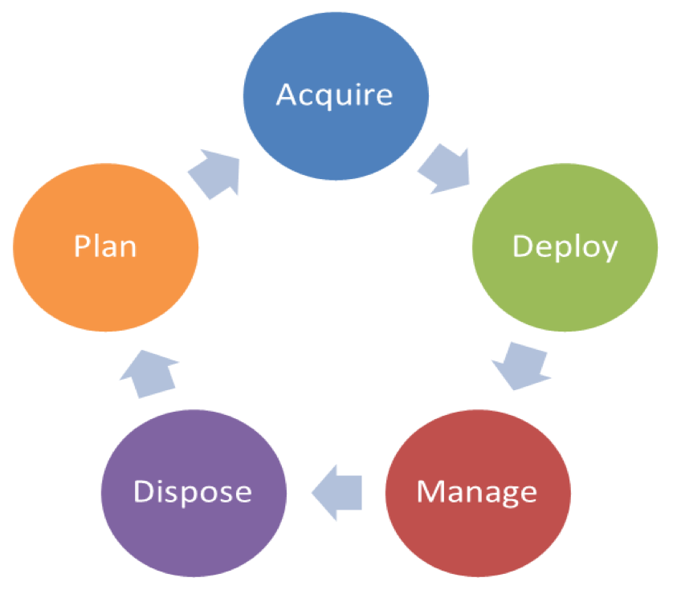
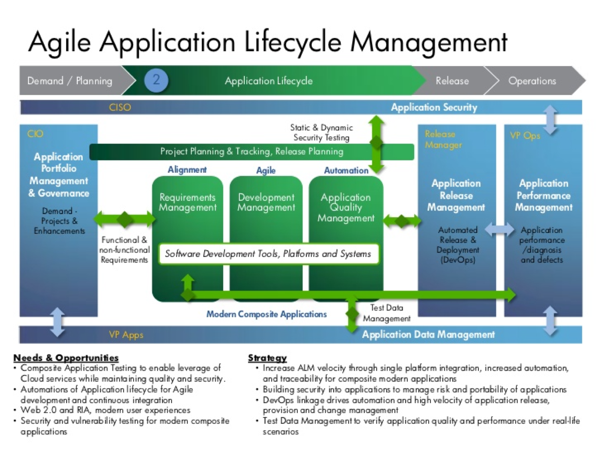
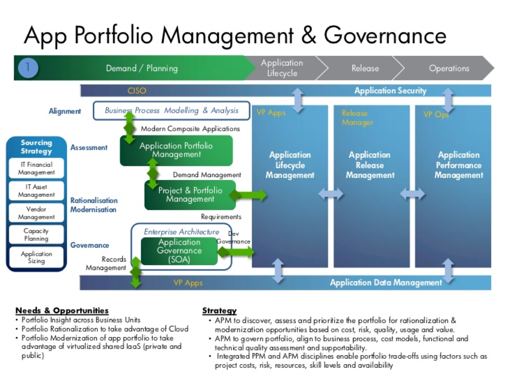
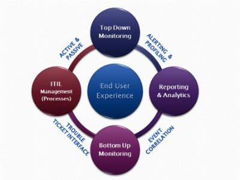

******************************************
**Application lifecycle management (ALM)**
******************************************

.. contents::

**Introduction**
****************

Application lifecycle management (ALM) is the supervision of a software application from its initial planning through
retirement. It also refers to how changes to an application are documented and tracked.

|image0|

**Application Portfolio Management**
************************************

Application portfolio management (APM) is a framework for managing enterprise IT software applications and software-based services. APM provides managers with an inventory of the company's software applications and metrics to illustrate the business benefits of each application.

Application portfolio management is a critical part of IT governance. It enables organizations to inventory and manage all their applications in a highly transparent manner. 

Application Portfolio Management is an approach to managing IT software applications and software-based services across the enterprise. Mapping the universe of software applications against a common set of strategic drivers of investment allows you to make critical decisions about which applications to maintain, invest, retire or consolidate. Our approach to APM is centered on cost, performance and strategic alignment with business needs.

|image2|

An APM system uses a scoring algorithm for generating reports about the value of each application and the health of the IT infrastructure as a whole. By gathering metrics like an application's age, how often it's used, the cost it takes to maintain it and its interrelationships with other applications, a manager can use more than just an educated guess to decide whether or not a particular application should be kept, updated, retired or replaced. 

**Application Lifecycle Management**
************************************

ALM is a very broad term that reflects a change in attitude towards software development that is also expressed in the term DevOps. DevOps blends the tasks performed by a company's application development and systems operations teams. In the past, a development team might work independently using a waterfall development model and hand off the completed software application to an operations team for deployment and maintenance. Today, it is more likely that developers will use an agile model and remain involved with the application after deployment, working with business owners and operations to make incremental changes as needed.  

|image1|

There are many ALM tools available for tracking application changes. These range from dedicated ALM products that monitor an application from inception to completion, automatically sorting files into logical buckets as changes are noted, to simple wikis that require team members to record changes manually.

- Application Lifecycle Management (ALM) is a continuous process of managing the life of an application through governance, development and maintenance.

- ALM is about managing the entire application lifecycle, from the initial application definition to application maintenance, retirement and everything in between.

- ALM as a superset, one that should include one or more SDLCs.

**Application Release Management**
**********************************

Release management is a relatively new but rapidly growing discipline within software engineering. As software systems, software development processes, and resources become more distributed, they invariably become more specialized and complex. Furthermore, software products (especially web applications) are typically in an ongoing cycle of development, testing, and release, often running on evolving platforms with growing complexity. Such systems require dedicated resources to oversee the integration and flow of development, testing, deployment, and support.

In organizations that manage IT operations using the IT Service Management paradigm, specifically the ITIL framework, release management will be guided by ITIL concepts and principles. There are several formal ITIL Processes that are related to release management, primarily the Release and Deployment Management process, which "aims to plan, schedule and control the movement of releases to test and live environments.", and the Change Management process In ITIL organizations, releases tend to be less frequent than in an agile development environment. Release processes are managed by IT operations teams using IT Service Management ticketing systems, with less focus on automation of release processes.

**Continuous Deilvery**

Organizations that have adopted agile software development are seeing much higher quantities of releases[citation needed]. With the increasing popularity of agile development a new approach to software releases known as Continuous delivery is starting to influence how software transitions from development to a release. One goal of Continuous Delivery and DevOps is to release more reliable applications faster and more frequently. The movement of the application from a “build” through different environments to production as a “release” is part of the Continuous Delivery pipeline. Release managers are beginning to utilize tools such as application release automation and continuous integration tools to help advance the process of Continuous Delivery and incorporate a culture of DevOps by automating a task so that it can be done more quickly, reliably, and is repeatable. More software releases have led to increased reliance on release management and automation tools to execute these complex application release processes.

**Application Performance Management**
**************************************

Application Performance Mamnagement, is largely an industry or vendor created term for anything that has to do with managing or monitoring the performance of your code, application dependencies, transaction times, and overall user experience.

|image7.png|

Since Application Performance Management is sort of a ubiquitous term for anything and everything performance related, some vendors use the term to mean totally different things, and can span several different types of vendor solutions.

- App Metrics based – Several tools use various server and app metrics and call it APM. At best they can tell you how many requests your app gets and potentially which URLs might be slow. Since they don’t do code level profiling, they can’t tell you why.

- Code level performance – Stackify Retrace, New Relic, AppDynamics, and Dynatrace are the typical type of APM products you think of, based on code profiling and transaction tracing.

- Network based – Extrahop uses the term APM in regards to their ability to measure application performance based on network traffic. There is a whole product category called NPM that focuses on this type of solutions.

   

   

