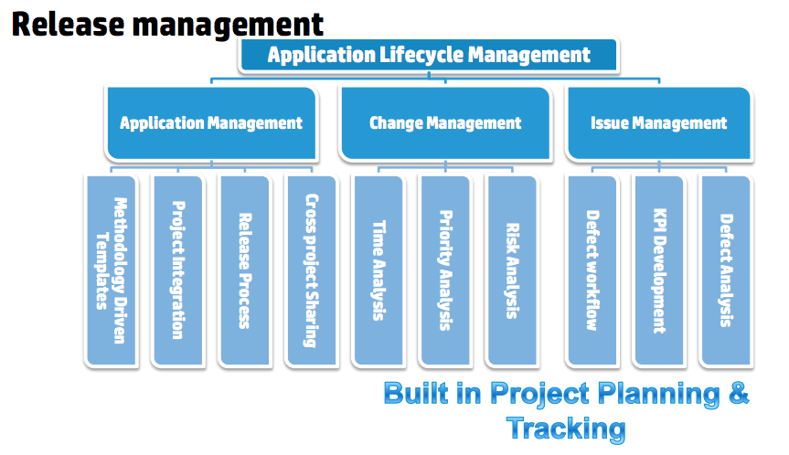

******************************************
**Application lifecycle management (ALM)**
******************************************

.. contents::

**Introduction**
****************

Application lifecycle management (ALM) is the supervision of a software application from its initial planning through
retirement. It also refers to how changes to an application are documented and tracked.

|image0|

**Application Portfolio Management**
************************************

Application portfolio management (APM) is a framework for managing enterprise IT software applications and software-based services. APM provides managers with an inventory of the company's software applications and metrics to illustrate the business benefits of each application.

Application portfolio management is a critical part of IT governance. It enables organizations to inventory and manage all their applications in a highly transparent manner. 

Application Portfolio Management is an approach to managing IT software applications and software-based services across the enterprise. Mapping the universe of software applications against a common set of strategic drivers of investment allows you to make critical decisions about which applications to maintain, invest, retire or consolidate. Our approach to APM is centered on cost, performance and strategic alignment with business needs.

|image2|

An APM system uses a scoring algorithm for generating reports about the value of each application and the health of the IT infrastructure as a whole. By gathering metrics like an application's age, how often it's used, the cost it takes to maintain it and its interrelationships with other applications, a manager can use more than just an educated guess to decide whether or not a particular application should be kept, updated, retired or replaced. 

**Application Lifecycle Management**
************************************

ALM is a very broad term that reflects a change in attitude towards software development that is also expressed in the term DevOps. DevOps blends the tasks performed by a company's application development and systems operations teams. In the past, a development team might work independently using a waterfall development model and hand off the completed software application to an operations team for deployment and maintenance. Today, it is more likely that developers will use an agile model and remain involved with the application after deployment, working with business owners and operations to make incremental changes as needed.  

|image1|

There are many ALM tools available for tracking application changes. These range from dedicated ALM products that monitor an application from inception to completion, automatically sorting files into logical buckets as changes are noted, to simple wikis that require team members to record changes manually.

- Application Lifecycle Management (ALM) is a continuous process of managing the life of an application through governance, development and maintenance.

- ALM is about managing the entire application lifecycle, from the initial application definition to application maintenance, retirement and everything in between.

- ALM as a superset, one that should include one or more SDLCs.

**Application Release Management**
**********************************

Release management is a relatively new but rapidly growing discipline within software engineering. As software systems, software development processes, and resources become more distributed, they invariably become more specialized and complex. Furthermore, software products (especially web applications) are typically in an ongoing cycle of development, testing, and release, often running on evolving platforms with growing complexity. Such systems require dedicated resources to oversee the integration and flow of development, testing, deployment, and support.

|image8|

In organizations that manage IT operations using the IT Service Management paradigm, specifically the ITIL framework, release management will be guided by ITIL concepts and principles. There are several formal ITIL Processes that are related to release management, primarily the Release and Deployment Management process, which "aims to plan, schedule and control the movement of releases to test and live environments.", and the Change Management process In ITIL organizations, releases tend to be less frequent than in an agile development environment. Release processes are managed by IT operations teams using IT Service Management ticketing systems, with less focus on automation of release processes.

**Continuous Deilvery**

Organizations that have adopted agile software development are seeing much higher quantities of releases[citation needed]. With the increasing popularity of agile development a new approach to software releases known as Continuous delivery is starting to influence how software transitions from development to a release. One goal of Continuous Delivery and DevOps is to release more reliable applications faster and more frequently. The movement of the application from a “build” through different environments to production as a “release” is part of the Continuous Delivery pipeline. Release managers are beginning to utilize tools such as application release automation and continuous integration tools to help advance the process of Continuous Delivery and incorporate a culture of DevOps by automating a task so that it can be done more quickly, reliably, and is repeatable. More software releases have led to increased reliance on release management and automation tools to execute these complex application release processes.

**Software QA**
***************

QA tends to be focused on measuring and examining quality and improving the software through process improvements, thereby guiding the release to customers. Although testing activities usually do take place in this organization, the main focus of QA is on the processes and procedures of how software development activities take place.

QA is more focused on managing the product life cycle and verifying that the software meets the defined quality standards or customer agreements. QA is less about breaking the software and finding problems than about verifying that it is possible to make the software work under a given set of conditions.

**Software Test**
*****************

Testing, on the other hand, may keep an eye on the processes and often owns them, but is far more concerned with finding ways to break the software. Testers are to observe what the software does and to report on the level of quality as well as any serious issues they encounter.

Testers must operate under the assumption that there are more bugs out there, and they have to find them. They operate in such a way that they expect to find problems, not just to verify that it is possible for everything to work fine. A good tester is one who is constantly thinking of things that have not been tried and is expected to exercise parts of the software that may be weak or that may not interact well. The whole point of this very critical look at software is to find bugs as fast as possible and get the right ones fixed. There will always be more bugs, but without knowing what they are, a conscious decision cannot be made regarding the software’s ability to meet the customer’s demands.

Test organizations can become flooded with bad software and drown in bugs if they are not going about their side of the process correctly. This will happen when a test organization becomes too reactive, only catching bugs instead of proactively preventing them. Individual testers may be required, above all else, to find more bugs. However, this focus on increasing the number of bugs instead of increasing the quality of the software can lead to the demise of many organizations.

A system that encourages subversion of the ultimate goal—making a software product that fulfills the customer’s needs—is not one to adopt. In a problematic system, testers are encouraged to find bugs after the bug has become part of the code base—when it is easy to quantify, and yet more expensive to correct than if it had been caught at an earlier stage. The problem with systems that reward individuals for meeting an intermediary goal is that people will achieve that goal instead of the ultimate goal.

The ultimate goal of any software development effort is to ship a high-quality product within a certain period of time and within a certain budget. Tasking individuals to find vast numbers of bugs may appear to be making progress towards the goal of making high-quality software, but that is not necessarily true. It is actually encouraging people to find problems in the software at a very late stage and to concentrate on finding symptoms instead of finding the core source of many symptoms.

Although many testers would never take advantage of a poorly constructed system, it still should not be set up in this way because it is not rewarding people for doing what management really wants. Failing to do that will eventually lead to an organization that has lost key members who saw past the reward system, leaving behind an organization that plays to management’s set of rewards.

Test organizations that are not effectively communicating with the rest of the software team (development and project managers) will not be aware of proposed changes and will not be able to step in early in the process to prevent problems, which allows a torrential flood of bugs to come back to testers late in the cycle and can end up costing the company time and money. Testing needs to evaluate processes as well as break the software.

**Application Performance Management**
**************************************

Application Performance Mamnagement, is largely an industry or vendor created term for anything that has to do with managing or monitoring the performance of your code, application dependencies, transaction times, and overall user experience.

|image7|

Since Application Performance Management is sort of a ubiquitous term for anything and everything performance related, some vendors use the term to mean totally different things, and can span several different types of vendor solutions.

- App Metrics based – Several tools use various server and app metrics and call it APM. At best they can tell you how many requests your app gets and potentially which URLs might be slow. Since they don’t do code level profiling, they can’t tell you why.

- Code level performance – Stackify Retrace, New Relic, AppDynamics, and Dynatrace are the typical type of APM products you think of, based on code profiling and transaction tracing.

- Network based – Extrahop uses the term APM in regards to their ability to measure application performance based on network traffic. There is a whole product category called NPM that focuses on this type of solutions.

.. |image0| image:: ./media/image1.png
   :width: 4.73125in
   :height: 3.03056in
   
.. |image1| image:: ./media/image3.png
   :width: 4.73125in
   :height: 3.03056in
   
.. |image2| image:: ./media/image2.png
   :width: 4.73125in
   :height: 3.03056in
   

.. |image7| image:: ./media/image7.png
   :width: 4.73125in
   :height: 3.03056in

