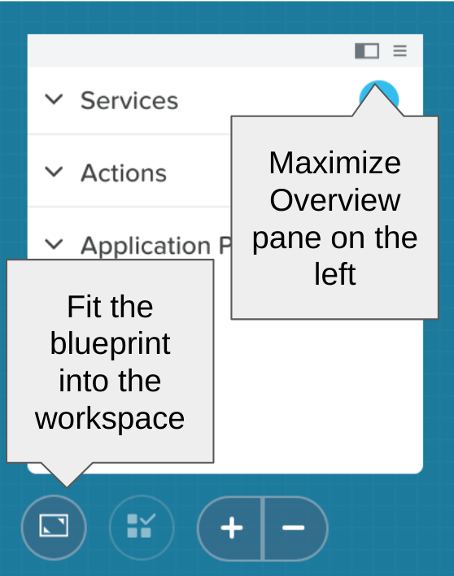
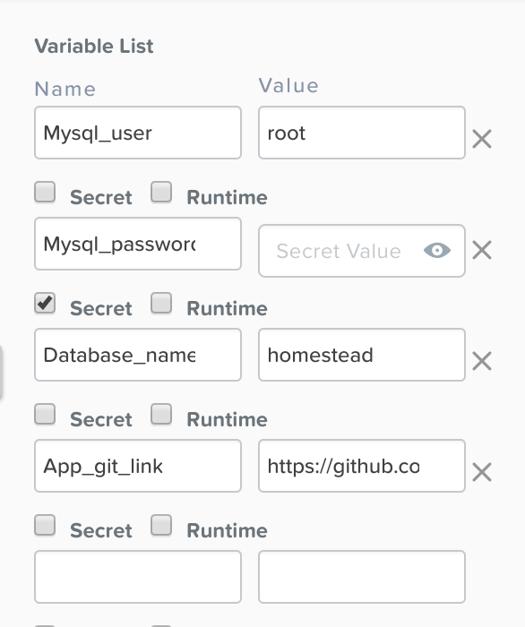
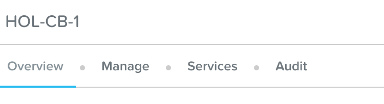
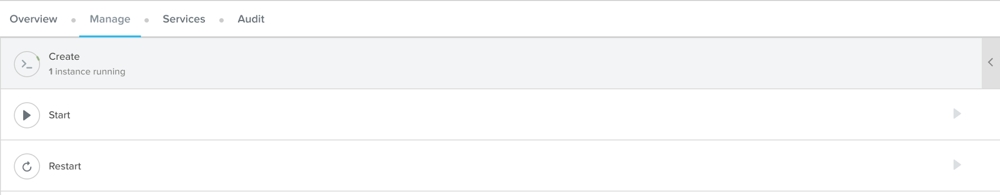
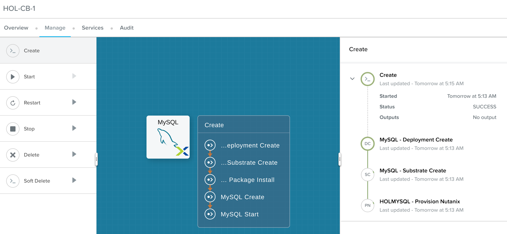
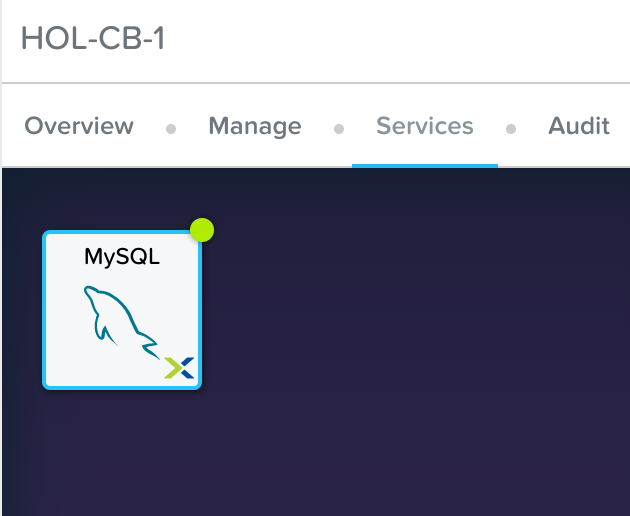
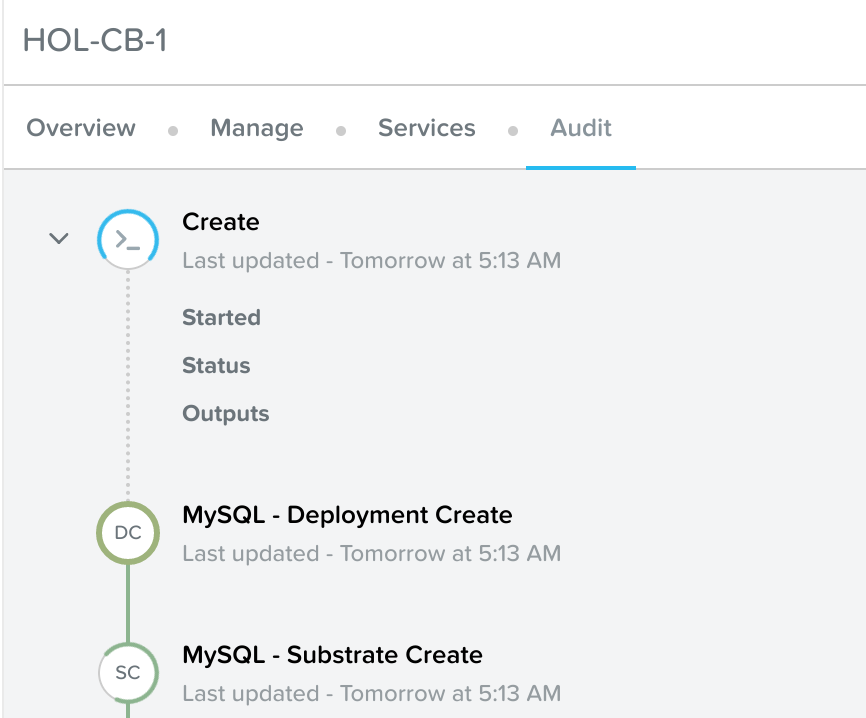

*******************************************
**Introduction – Simple Blueprint (MySQL)**
*******************************************

.. contents::

**Connectivity Instructions:**
******************************

+------------+--------------------------------------------------------+
| IP         |                                           Cluster IP   |
+------------+--------------------------------------------------------+
| Username   |                                           Cluster User |
+------------+--------------------------------------------------------+
| Password   |                                           Cluster Pass | 
+------------+--------------------------------------------------------+

Lab Overview
************

Welcome to the Calm Hands-On-Lab - Simple Blueprint. What we’re going to
do here is make a basic blueprint:

|image0|

This is a basic MySQL Deployment. In this lab we’ll start with a very
basic, single service.

**Calm Glossary**
*****************

**Service**: One tier of a multiple tier application. This can be made
up of 1 more VMs (or existing machines) that all have the same config
and do the same thing

**Application (App):** A whole application with multiple parts that are
all working towards the same thing (for example, a Web Application might
be made up of an Apache Server, a MySQL database and a HAProxy Load
balancer. Alone each service doesn’t do much, but as a whole they do
what they’re supposed to).

**Macro:** A Calm construct that is evaluated and expanded before being
ran on the target machine. Macros and Variables are denoted in the
@@{[name]}@@ format in the scripts.

**Part 1: Accessing and Navigating Calm**
*****************************************

Getting Familiar with the Tools

1. Connect to https://<HPOC.PC:9440>

2. Login to Prism Central using the credentials specified above (use
   these credentials unless specified otherwise throughout this lab


3. Click on the Apps tab across the top of Prism

Welcome to Calm! Upon accessing this page you will now notice a new
ribbon along the left ­ this is used to navigate through Calm.

You are, by default, dropped into the Applications tab and can see all
the instances of applications that have been launched from a blueprint.

For now, let’s step through each tab:

|image1|

**Part 2: Your Entry Level Blueprint**
**************************************

1. Navigate to the Blueprint ( |image2|) tab

2. Click on **Create Blueprint **

3. Assign this Blueprint to the Default Project
Welcome to the Blueprint
   Editor! Let’s take a look at the interface

|image3|

In general, the Blueprint creation flow goes:

-  Create Object in Application Overview
○ Or select an existing object
   either from the workspace or the Overview panel

-  Configure the object in the configuration pane

-  Repeat for each object

-  Connect dependencies in the workspace

There are 2 more buttons that are helpful to use while making a
blueprint:

|image4|

Let’s get started by setting up the basics

1. Update the Blueprint Name to **HOL­<<yourName>> **

2. Click on Credentials ( |image5|) button ○ Credentials are unique per
   blueprint

|image6|

+-----------------------+---------------+
| **Name **             | Your choice   |
+-----------------------+---------------+
| **Username **         | root          |
+-----------------------+---------------+
| **Secret **           | Password      |
+-----------------------+---------------+
| **Password **         | nutanix/4u    |
+-----------------------+---------------+
| **Use as Default **   | Checked       |
+-----------------------+---------------+

Setting Variables

At this step let’s set some variables up. It’s not necessary to do it at
this point, however it will make our lives easier for the rest of the
lab.

Variables have 2 settings, **Secret** and **Runtime**. Normally
variables are stored in plaintext and shown in the window here, the
**Secret** setting changes that (perfect for passwords). **Runtime**
specifies if this variable should be static (and only editable here) or
should be able to be changed during the Launch Process.

Variables can be referred to while configuring VMs using the
**@@{variable\_name}@@** construct ­ Calm will evaluate and replace that
string before sending it down to the VM

|image7|

+----------------------+------------------------------------------------------+
| **Variable Name **   | **Value **                                           |
+----------------------+------------------------------------------------------+
| Mysql\_user          | root                                                 |
+----------------------+------------------------------------------------------+
| Mysql\_password      | nutanix/4u                                           |
+----------------------+------------------------------------------------------+
| Database\_name       | homestead                                            |
+----------------------+------------------------------------------------------+
| App\_git\_link       | https://github.com/ideadevice/quickstart­basic.git   |
+----------------------+------------------------------------------------------+

Setup the variables as specified in the table above.

**Adding A DB Service**

With these basics setup, let’s create our first service.

1. Click the + sign next to **Services** in the **Overview** pane.

2. Notice that the **Configuration** pane has changed and there is now a
   box in the **Workspace.**

3. Name your service DBService at the top

4. The Substrate section is the internal Calm name for this Service.
   Name this **MySQLSubstrate.**

5. Make sure that the Cloud is set to **Nutanix** and the OS set to
   **Linux** Configure the VM as shown below:

Now update the VM Configuration section to match the following:

|image10|

1. Scroll to the bottom and add a NIC attached to the **DemoVMs**
   network

2. Configure the **Credentials** at the bottom to use the credentials
   you made above

3. Scroll back up to the top and click **Package**

**Package Configuration**

Here is where we specify the installation and uninstall scripts for this
service. Give the install package a name (MySQL\_Package for example),
set the install

script to **shell** and select the credential you created earlier. Copy
the following script into the **install** window:

.. code-block:: bash

   #!/bin/bash
   set -ex
   
   yum install -y "http://repo.mysql.com/mysql-community-release-el7.rpm"
   yum update -y
   yum install -y mysql-community-server.x86_64
   
   /bin/systemctl start mysqld
   
   #Mysql secure installation
   mysql -u root<<-EOF
   
   #UPDATE mysql.user SET Password=PASSWORD('@@{Mysql_password}@@') WHERE User='@@{Mysql_user}@@';
   DELETE FROM mysql.user WHERE User='@@{Mysql_user}@@' AND Host NOT IN ('localhost', '127.0.0.1', '::1');
   DELETE FROM mysql.user WHERE User='';
   DELETE FROM mysql.db WHERE Db='test' OR Db='test\_%';
   
   FLUSH PRIVILEGES;
   EOF
 
   sudo yum install firewalld -y
   sudo service firewalld start
   sudo firewall-cmd --add-service=mysql --permanent
   sudo firewall-cmd --reload
 
   #mysql -u @@{Mysql_user}@@ -p@@{Mysql_password}@@ <<-EOF
   mysql -u @@{Mysql_user}@@ <<-EOF
   CREATE DATABASE @@{Database_name}@@;
   GRANT ALL PRIVILEGES ON homestead.* TO '@@{Database_name}@@'@'%' identified by 'secret';
 
   FLUSH PRIVILEGES;
   EOF
   
   
Looking at this script, we see that we’re using the variables we set
before and doing basic mySQL configuration. This can be customized for
whatever unique need you have.

Since we don’t need anything special ran when uninstalling, we will just
add a very basic script to the uninstall. This can be useful for cleanup
(for example, releasing DNS names or cleaning up AD), but we won’t use
it here.

Set the uninstall script to **shell** and select the credential you used
earlier. Fill the uninstall script window with a simple:

.. code-block:: bash
   
   #!/bin/bash
   echo "Goodbye!"

After doing all the configuration click the **Save** button. If any
errors come up, go back and review the configuration to ensure that all
fields have been filled.

**Part 3: Launching the Blueprint**
***********************************

Now that the blueprint has been created and saved, you can launch it!

Click on the **Launch** button in the top right. This will bring up the
the launch window. Give this instance a unique name
(**HOL\_<<YourName>>\_1**). Note that for every launch you do you will
need to increment this as instance names must be unique.

This will now bring you to the **Instance** page. The bar across the top
allows you to see various information about the instance:

|image11|

**Manage** allows you to see all the actions you can run against this
instance (we’ll get to creating custom actions in a moment).

You can also click on the arrow all the right on an action to see what
it does and ­ if it’s currently running ­ where in the process it is.

|image12|

|image13|

The **Services** tab show you information about the VMs that make up
this instance.

Finally the **Audit** tab shows you what actions have been called
against this instance and by who. You can also click on any action (or
sub­action) and get the logs from that event.

|image14|

|image15|

**NOTE:** In this lab, the only active project is **Default** and all
users are a member of it.

.. |image0| image:: ./media/image1.png
   :width: 4.73125in
   :height: 3.03056in
.. |image1| image:: ./media/image2.png
   :width: 3.84792in
   :height: 4.45278in

.. |image3| image:: ./media/image4.png
   :width: 5.79314in
   :height: 3.93637in

.. |image6| image:: ./media/image7.png
   :width: 2.90364in
   :height: 3.25278in

.. |/Users/nathancox/Desktop/Screen Shot 2017-11-29 at 11.54.22 AM.png| image:: ./media/media/image9.png
   :width: 2.99372in
   :height: 3.22371in
.. |/Users/nathancox/Desktop/Screen Shot 2017-11-29 at 12.03.25 PM.png| image:: ./media/media/image10.png
   :width: 3.01458in
   :height: 5.12232in
.. |image10| image:: ./media/image11.png
   :width: 4.98125in
   :height: 0.46933in

