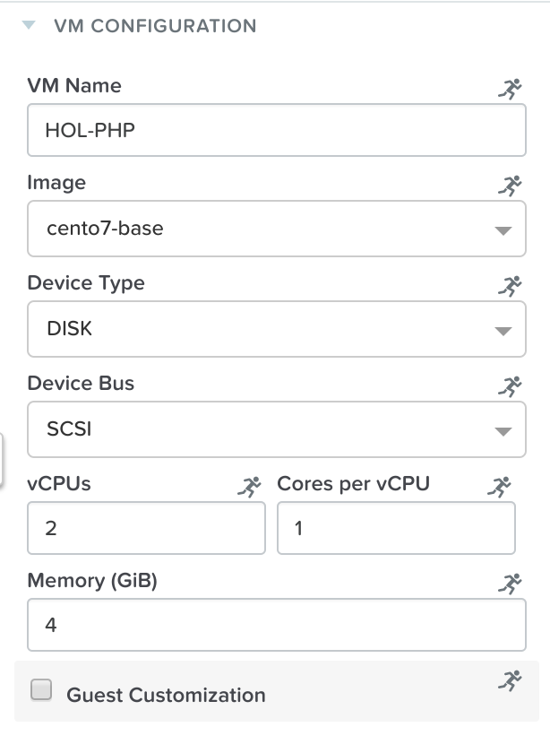
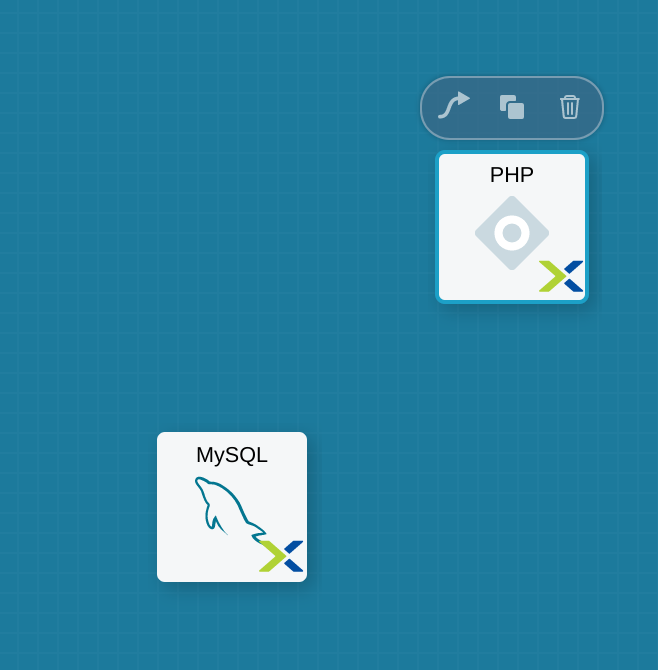
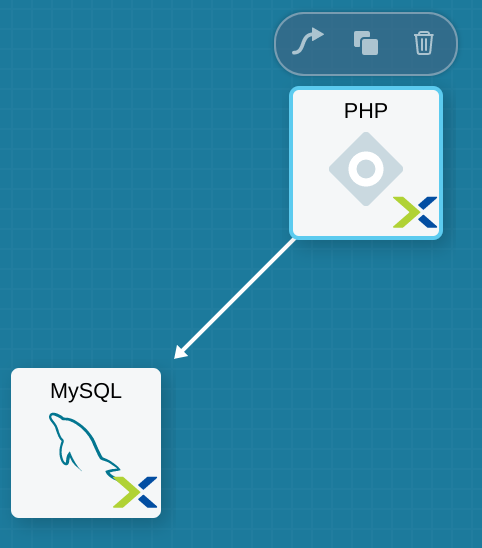
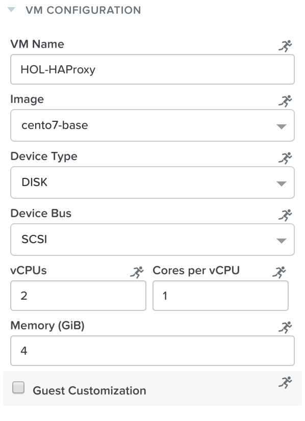
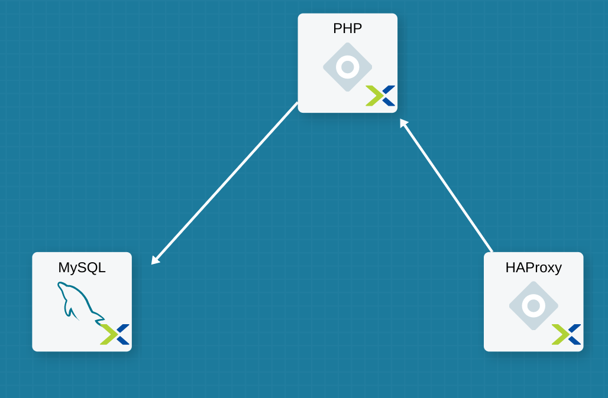
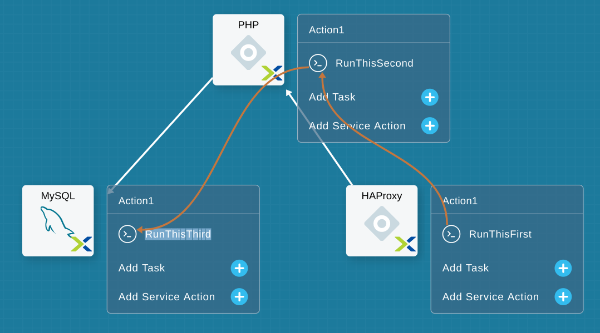
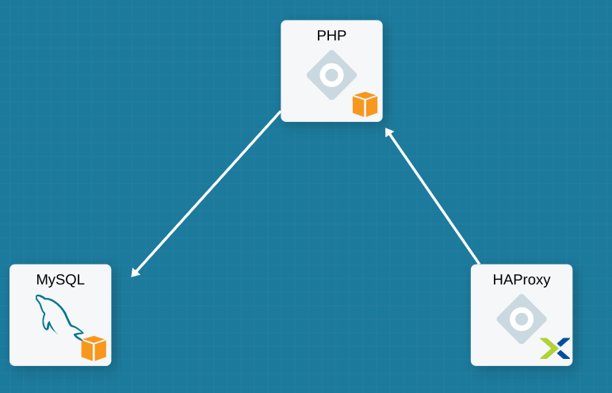

************************************************
**Introduction – Intermediate Blueprint (LAMP)**
************************************************

.. contents::

**Connectivity Instructions**
*****************************

+------------+----+
| IP         |    |
+------------+----+
| Username   |    |
+------------+----+
| Password   |    |
+------------+----+

**Lab Overview**
****************

Welcome to the Calm Hands-On-Lab - Intermediate Blueprint What we’re
going to do here is extend a basic blueprint:  

|image0|

This is a basic LAMP Stack (Linux Apache MySQL PHP). In
this lab we’ll build on the previous 1x simple service MySQL
blueprint and evolve this into the multi-stack application you see
above.

**Calm Glossary**

**Service**: One tier of a multiple tier application. This can be made
up of 1 more VMs (or existing machines) that all have the same config
and do the same thing

**Application (App):** A whole application with multiple parts that are
all working towards the same thing (for example, a Web Application might
be made up of an Apache Server, a MySQL database and a HAProxy Load
balancer. Alone each service doesn’t do much, but as a whole they do
what they’re supposed to).

**Macro:** A Calm construct that is evaluated and expanded before being
ran on the target machine. Macros and Variables are denoted in the
@@{[name]}@@ format in the scripts.

**Part 1: Accessing and Navigating Calm**
*****************************************

Getting Familiar with the Tools

1. Connect to https://<HPOC.PC:9440>

2. Login to Prism Central using the credentials specified above (use
   these credentials unless specified otherwise throughout this lab


3. Click on the Apps tab across the top of Prism

Welcome to Calm! Upon accessing this page you will now notice a new
ribbon along the left ­ this is used to navigate through Calm.

You are, by default, dropped into the Applications tab and can see all
the instances of applications that have been launched from a blueprint.

For now, let’s step through each tab:

|image1|

**Part 2: Creating a Web Server**
*********************************
In this step we’ll add a second tier and connect it back into the DB
Service created from Lab #1 Simple Blueprint service(MySQL).

1. Click the + sign next to **Services** in the **Overview** pane

2. Notice that there is now a second block in the workspace.

3. Rearrange the icons to your liking, then click on the new Service 2.
   Since this is our application server, name the service AppService.

4. Give the Substrate a name, and choose a VM name like above. Proceed
   and configure the rest of the application as we did with the DB
   server

|image2|

|image3|

Be sure to scroll down, add a NIC and configure the credentials.

Now that our PHP server has the basic VM settings, navigate over to the
Package page.

Once again, give the package a unique name (PHPPackage) and set the
script type to shell (using the credentials you used above). Fill in the
Install script with the following script:

.. code-block:: bash

   #!/bin/bash
   sudo yum update -y
   sudo yum -y install epel­release
   rpm -Uvh https://mirror.webtatic.com/yum/el7/webtatic-release.rpm
   sudo yum install -y nginx php56w­fpm php56w-cli php56w-mcrypt php56w-mysql php56w-mbstring php56w-dom git
   mkdir -p /var/www/laravel
   echo "server {
         listen   80 default_server;
         listen [::]:80 default_server ipv6only=on;
         root /var/www/laravel/public/;
         index index.php index.html index.htm;
         location / {
             try_files \$uri \$uri/ /index.php?\$query_string;
         }
         # pass the PHP scripts to FastCGI server listening on/var/run/php5­fpm.sock
         location ~ \.php$ {
                  try_files \$uri /index.php =404;
                  fastcgi_split_path_info ^(.+\.php)(/.+)\$;
                  fastcgi_pass 127.0.0.1:9000;
                  fastcgi_index index.php;
                  fastcgi_param SCRIPT_FILENAME \$document_root\$fastcgi_script_name;
                  include fastcgi_params;
         }
   }" |sudo tee /etc/nginx/conf.d/laravel.conf
   sed -i 's/80 default_server/80/g' /etc/nginx/nginx.conf
   if `grep "cgi.fix_pathinfo" /etc/php.ini` ; then
      sed -i 's/cgi.fix_pathinfo=1/cgi.fix_pathinfo=0/' /etc/php.ini
   else
      sed -i 's/;cgi.fix_pathinfo=1/cgi.fix_pathinfo=0/' /etc/php.ini
   fi
   
   #sudo php5enmod mcrypt
   sudo systemctl restart php-fpm
   sudo systemctl restart nginx
   if [ ! -e /usr/local/bin/composer ] then
      curl -sS https://getcomposer.org/installer | php
      mv composer.phar /usr/local/bin/composer
      chmod +x /usr/local/bin/composer
   fi
   
   git clone @@{App_git_link}@@ /var/www/laravel
   sed -i 's/DB_HOST=.*/DB_HOST=@@{DBService.address}@@/' /var/www/laravel/.env
   sudo su - -c "cd /var/www/laravel; composer install ; php artisan migrate"
   
   chown -R nginx:nginx /var/www/laravel
   chmod -R 777 /var/www/laravel/
 
   systemctl restart php-fpm
   systemctl restart nginx
   sudo yum install firewalld -y
   sudo service firewalld start
   sudo firewall-cmd --add-service=http --zone=public --permanent
   sudo firewall-cmd --reload
   sleep 2

Here you see variables like before, but also something new:

@@{MySQL.address}@@

This is a **Calm Macro**. What this does it get the IP address from
the
\ **MySQL** server and replaces that in this script. With that it
doesn’t matter what IP the DB comes up with, the PHP server will always
know where it’s DB is. There are many more native macros ­ a full list
will be available in documentation at launch!

Fill­in the uninstall script with the same basic exit as before:

.. code-block:: bash

   #!/bin/bash
   echo "goodbye!"

Before we’re finished here, we have 1 more step to do. Since we need the
DB address to bring up the PHP server, we need to add a **Dependency**.
Click on the

**PHP** service, click on the Arrow icon that appears right above it,
then click on the **MySQL** service

This tells Calm to hold running the script until the **MySQL** service
is up. **Save** the blueprint, then click on the **Create** action from
the **Overview** pane to see this.

**Part 3: Scale­out PHP and Load Balancer ** 
********************************************

In this part we’re going to finally finish the provisioning blueprint.  

1. Click on the \ **PHP **\ service. 

2. Click on the \ **Service **\ tab. 

3. Change \ **Number of
   replicas **\ under \ **Deployment Config **\ from 1 to 2.  

     

This service will now deploy 2 VMs with the same configuration rather
than just 1

    |image4|

    |image5|

We’ve now added redundancy or load balancing capacity to the PHP server,
but need something to actually to the load balancing.

1. Add another Service. This will be our load balancer, so name the
   Service **HAProxy**, give the substrate and VM a name and configure
   the rest of the service.

2. Remember to configure the NIC and credentials at the bottom

Under **Package** configure the following install script

|image6|

|image7|

Under **Package** configure the following install script:

.. code-block:: bash

   #!/bin/bash
   set -ex
 
   sudo yum update -y
   sudo yum install -y haproxy
   echo "global
         log 127.0.0.1 local0
         log 127.0.0.1 local1 notice
         maxconn 4096
         quiet
         user haproxy
         group haproxy
         defaults
               log     global
               mode    http
               retries 3
               timeout client 50s
               timeout connect 5s
               timeout server 50s
               option dontlognull
               option httplog
               option redispatch
               balance  roundrobin
         # Set up application listeners here.
         listen stats 0.0.0.0:8080
         mode http
         log global
         stats enable
         stats hide-version
         stats refresh 30s
         stats show-node
         stats uri /stats
         listen admin
         bind 127.0.0.1:22002
         mode http
         stats uri /
         frontend http
         maxconn 2000
         bind 0.0.0.0:80
         default_backend servers­http
         backend servers-http" | tee /etc/haproxy/haproxy.cfg
         sudo sed -i 's/server host-/#server
         host-/g' /etc/haproxy/haproxy.cfg
         hosts=$(echo "@@{AppService.address}@@" | sed 's/^,//' | sed 's/,$//' | tr "," "\n")
         port=80
         for host in $hosts do
            echo "  server host­${host} ${host}:${port} weight 1 maxconn
            100 check" | tee ­a /etc/haproxy/haproxy.cfg
         done
         
         sudo systemctl daemon­reload
         sudo systemctl restart haproxy
         sudo yum install firewalld -y
         
         sudo service firewalld start
         sudo firewall-cmd -add-service=http --zone=public --permanent
         sudo firewall-cmd --add­port=8080/tcp --zone=public --permanent
         sudo firewall-cmd --reload
 
 
Notice we’re using **@@{PHP.address}@@** here just like before, but
putting it in a loop to get both PHP servers added to the HAProxy
config. Add the **Dependency** arrow like before.

Add the following uninstall script

.. code-block:: bash

   #!/bin/bash
   echo "goodbye!"

Your blueprint should now look like this:

|image8|

**Part 4: Next steps**
**********************

In this lab we just configured the provisioning steps. Calm also does
hybrid cloud management and lifecycle management. We also didn’t publish
this blueprint to the marketplace. Explore these on your own, using the
following as a guide as the ideas are the same throughout.

**Custom Actions**

Click the + sign next to **Actions** in the **Overview** pane to create
your own action.

You can now create variables specific to this action, add subtasks on
each service, and wire them up to ensure they are executed in the right
order

**NOTE:** The orange arrows run in the opposite direction then the white
provisioning arrows. Rather than pointing at what this subaction depends
on, it instead points in the order of operations.

|image9|

Application Profiles

You already have a default profile created, you can clone this by
clicking the ... next to the name. Using this you can now change
deployment configuration or move to a different cloud. With multiple
profiles, you will be asked which one you want when you go to launch the
application.

|image10|

**NOTE:** In this lab, the only active project is **Default** and all
users are a member of it.

.. |image0| image:: ./media/image1.png
   :width: 4.73125in
   :height: 3.03056in
.. |image1| image:: ./media/image2.png
   :width: 3.84792in
   :height: 4.45278in

