*********************************************
**Troubleshoot NuCalm Blueprints**
*********************************************

.. contents::

**Connectivity Instructions:**
******************************

+------------+--------------------------------------------------------+
| IP         |                                           Cluster IP   |
+------------+--------------------------------------------------------+
| Username   |                                           Cluster User |
+------------+--------------------------------------------------------+
| Password   |                                           Cluster Pass | 
+------------+--------------------------------------------------------+

Calm Glossary
*************

**Service:** One tier of a multiple tier application. This can be made up of 1 more VMs (or existing machines) that all have the same config and do the same thing **Application (App):** A whole application with multiple parts that are all working towards the same thing (for example, a Web Application might be made up of an Apache Server, a MySQL database and a HAProxy Load balancer. Alone each service doesn’t do much, but as a whole they do what they’re supposed to) **Macro:** A Calm construct that is evaluated before being ran on the target machine. Macros and Variables are denoted in the *@@{[name]}@@* format in the scripts.

Lab Overview
************

In this lab participants will learn about NuCalm Blueprint Best Practices, identify anamolies, and diagnose poorly written or defective Blueprints.

In this exercise we'll walk through the steps to:

1. Import a Blueprint.
2. Launch the Blueprint.
3. Debug the Blueprint.

**Note:** There should be a mapping or SMB share configured to connect to: **smb://pocfs.nutanixdc.local/images**.  This will be used to import existing blueprints.

Part 1: Accessing and Navigating Calm
*************************************

Getting Familiar with the Tools

1. Connect to https://[HPOC-IP-ADDRESS]:9440
2. Login to Prism using the credentials specified above (use these credentials unless specified otherwise throughout this lab
3. Click on the Apps tab across the top of Prism

Welcome to Calm! Upon accessing this page you will now notice a new ribbon along the left ­ this is used to navigate through Calm.

You are, by default, dropped into the Applications tab and can see all the instances of applications that have been launched from a blueprint.

**Tab review:**

|image0|

Part 2: Import Blueprint
************************

Navigate to the Blueprint Workspace by clicking (|image1|) icon located on the left tool ribbon.  This will open the Blueprint Workspace where self-authored blueprints are staged editing, publishing, and/or launching as Applications.  When the Blueprint grid appears, click the **Upload Blueprint** button located along the top of the Blueprint grid.  

|image2|

Navigate your SMB share for the **.../CalmWorkshp/Troubleshooting.json** blueprint.  Select the file and continue.  A modal dialog will appear prompting for a name and project when saving. Complete the fileds as show below and click **upload**. This will save the blueprint to the workspace.

- **Name:** Calm Workshop Blueprint Debug
- **Project:** Calm

|image3|

The Blueprint workspace should appear as follows.  

|image4|

Since Blureprints are exported as clear text, they do not retain credential information that could potentially be used maliciously.  You'll be required to set the **Credentials** to *User: root*,  *Password: nutanix/4u*.  Save the Blueprint.  The red **!** should no longer appear.

Part 3: Launch Blueprint
************************

Once the blueprint has been successfully saved, click the (|image5|) button to lanuch the Blueprint.  Name the application with *Calm Workshop Troubleshooting*.  

|image6|

Click **Create** to launch the application.

Part 4: Monitor Blueprint Execution
***********************************

Once the application has been launched, the Application Management Dialog will appear showing the state of the Application.  Click the *Audit* button in the tool-bar located along the top of the Application Management Dialog to monitor or audit the provisioning progress of the application.

|image7|

Continue to monitor the progress by expanding the **Create**

|image8|

Part 5: Debug Blueprint Errors
******************************

If an error occurs during the execution of a Blueprint, both the Application Management Dialog the and the *Audit* tree will show the error.

|image9|

|image10|

Using the *Audit* tree and expanding **Create**, scroll down to the first failure occurrance to read the logs and compare it with the script.

|image11|

Expand the **PackageInstallTask** for **Jenkins_Master-Package Install**.  You can toggle between the *script* and the *script output* to diagnose the problem...

|image12|

Examine the script's contents and it's output to get an idea of what failed.

|image13|

Make a note of what you suspect is failing. Make the changes within the Blueprint by navigating to the Blueprint Workspace from the Application Managment Dialog **Overview** and clicking the *Blueprint* link.

|image14|

Part 6: Cleanup Failed Blueprints
*********************************

Clean up the Application workspace by deleting the failed applications.  Click the *Manage* button in the tool-bar located along the top of the Application Management Dialog to execute an application action.  Click *Delete* to start a delete task.

|image15|

You can monitor the completion of the application deletion by clicking *Audit*

|image16|

Repeat parts 4-6 until application successfully deploys...

.. |image0| image:: ./media/image0.png

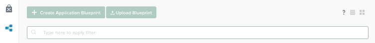
.. |image3| image:: ./media/image3.png
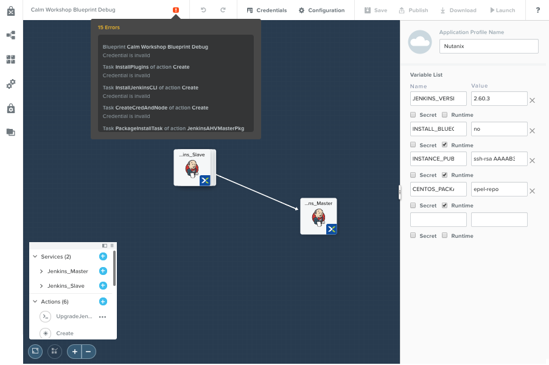

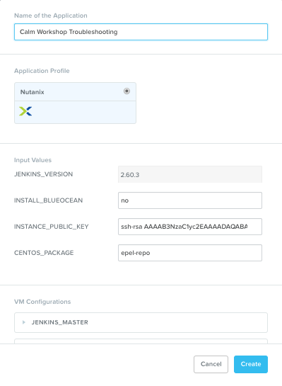
.. |image7| image:: ./media/image7.png
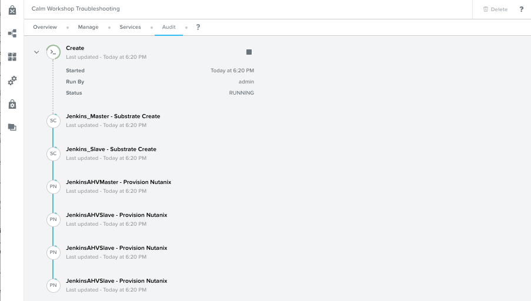
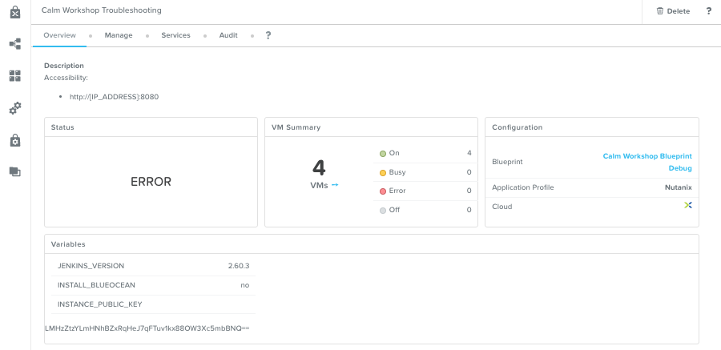

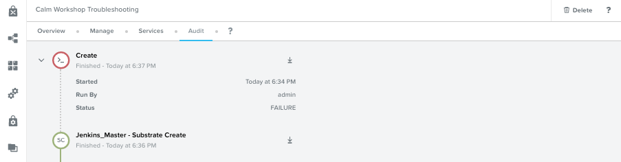
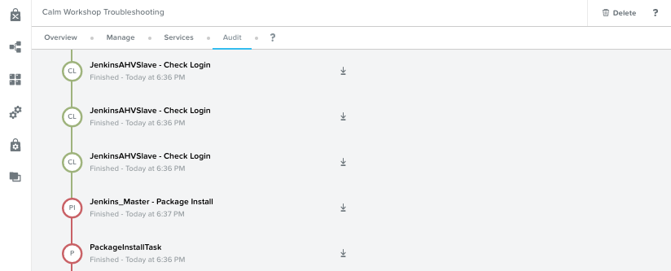
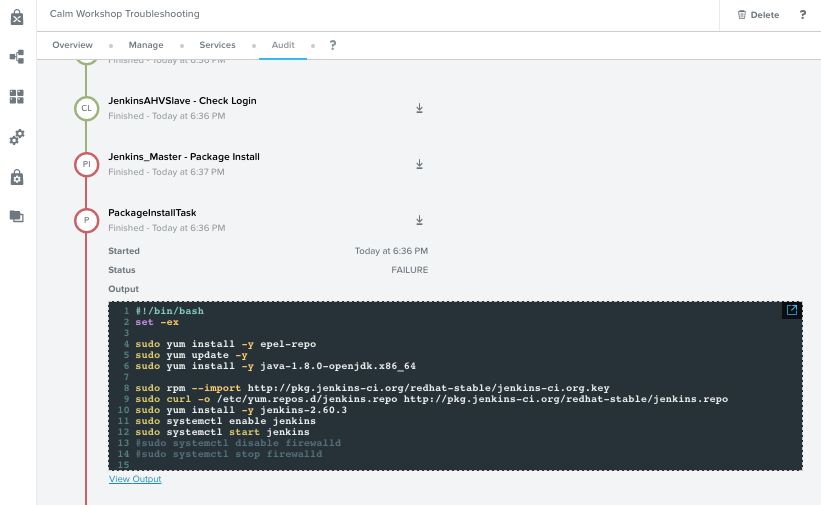
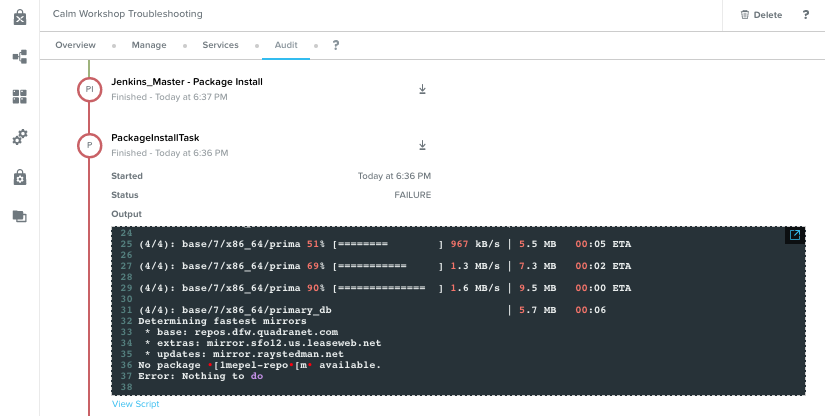
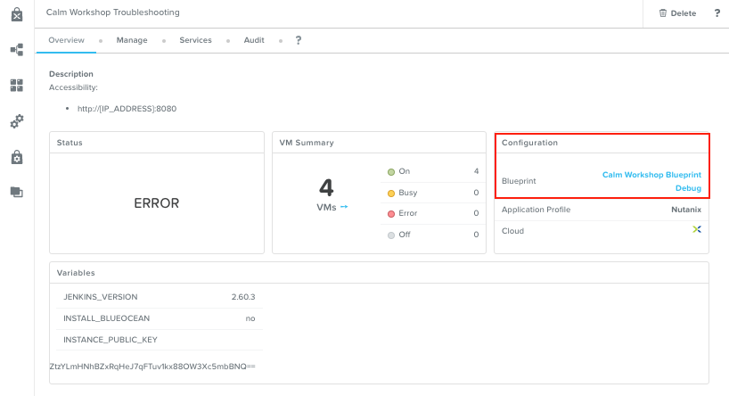
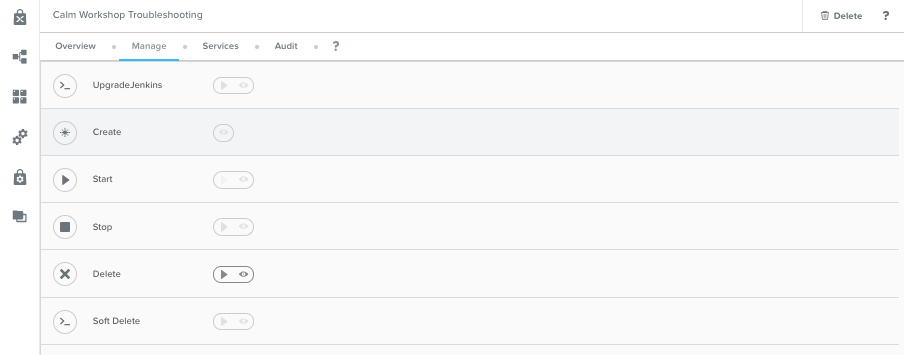
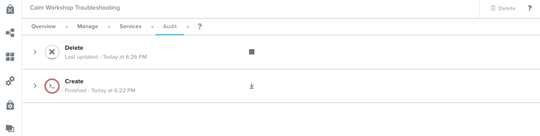

