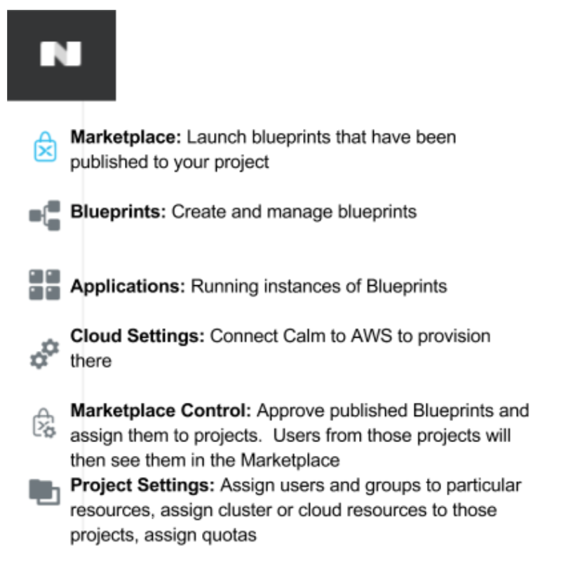

********************************
**NuCalm Blueprint Marketplace**
********************************

.. contents::

**Connectivity Instructions:**
******************************

+------------+--------------------------------------------------------+
| IP         |                                           Cluster IP   |
+------------+--------------------------------------------------------+
| Username   |                                           Cluster User |
+------------+--------------------------------------------------------+
| Password   |                                           Cluster Pass | 
+------------+--------------------------------------------------------+

**Calm Glossary**
*****************

Service: One tier of a multiple tier application. This can be made up of 1 more VMs (or existing machines) that all have the same config and do the same thing Application (App): A whole application with multiple parts that are all working towards the same thing (for example, a Web Application might be made up of an Apache Server, a MySQL database and a HAProxy Load balancer. Alone each service doesn’t do much, but as a whole they do what they’re supposed to) Macro: A Calm construct that is evaluated before being ran on the target machine. Macros and Variables are denoted in the @@{[name]}@@ format in the scripts.

Lab Overview
************

In this lab participants will learn how to manage NuCalm Blueprints within the NuCalm Marketplace.  After this lab
participants should know how to navigate and manage the Marketplace, publish blueprints to the market, deploy and/or clone
blueprints from the marketplace. 

**Part 1: Accessing and Navigating Calm**
*****************************************

Getting Familiar with the Tools

1. Connect to https://[HPOC-IP-ADDRESS]:9440
2. Login to Prism using the credentials specified above (use these credentials unless specified otherwise throughout this lab
3. Click on the Apps tab across the top of Prism

Welcome to Calm! Upon accessing this page you will now notice a new ribbon along the left ­ this is used to navigate through Calm.

You are, by default, dropped into the Applications tab and can see all the instances of applications that have been launched from a blueprint.

For now, let’s just go through each tab:

|image0|

 
