********************
**NuCalm REST APIs**
********************

.. contents::

**Connectivity Instructions:**
******************************

+------------+--------------------------------------------------------+
| IP         |                                           Cluster IP   |
+------------+--------------------------------------------------------+
| Username   |                                           Cluster User |
+------------+--------------------------------------------------------+
| Password   |                                           Cluster Pass | 
+------------+--------------------------------------------------------+

Lab Overview
************

The Automation Lab starts with an introduction to NuCalm REST API, and associated JSON. The lab is a set of exercises designed to walk participants through navigating the REST API Explorer, locating Blueprint and Appication REST requests, executing the requests, and observing the results using both the Swagger generated API Explorer (Prism Central). Participants will also deploy several commands using python.

NTNX REST API Explorer Requests:

- App
- Blueprint
- Role
- Project

Requirements:
*************

Reference:

- REST/HTTP Overview:  REST-HTTP-Overview_
- NTNX REST API Explorer Overview:  NTNX-REST-API-Explorer-Overview_
- Chrome Web Browser + Developer Tools
- Chrome JSON Editor: Chrome-JSON-Editor-Extension_

Development:

- CentOS Server v7 VM created:  configure-centos-server-v7_ 
- Python 2.7.x
- Git Hub Account: https://github.com

The Automation Lab starts with an introduction to NuCalm REST API, and associated JSON. The lab is a set of exercises designed to walk participants through navigating the REST API Explorer, locating Bluepint and Appication commands, executing the commands, and observing the results using both the Swagger generated API Explorer (Prism), and Postman (3^rd^ party API toolchain). Participants will then deploy several commands using python.

Create a CentOS Server v7 VM
****************************

Create a CentOS Server v7 VM on the assigned cluster using Prism Central using the folloiwng specifications:

- vCPU: 2x, 1x core/vCPU
- mem:  4 GiB
- network: bootcamp
- name: calm_lab_dev
- image: CentOS Server v7  (Disk)

  

Create a Development Environment
********************************

**Install pip, and requests:**

We'll need to make sure the python 2.7 runtime has all the appropriate packages, sepcifically *pip* and *requests*. We'll provision a CentOS Server VM to insure participants are working fromm a common-base.

- Pip is a tool for installing and managing Python packages.
- Requests is a Python package used to conmunicate over http.

*pip* is part of Extra Packages for Enterprise Linux (EPEL), which is a community repository of non-standard packages for the RHEL distribution. You'll be required to install the EPEL repository.

.. code-block:: bash

  $ yum install epel-release
  
As a matter of best practice we’ll update our package(s)
 
.. code-block:: bash
 
  $ yum -y update

Then let’s install python-pip and any required packages:

.. code-block:: bash

  $ yum -y install python-pip
  
View a list of helpful commands, and check the version of *pip* that is installed:

.. code-block:: bash

  $ pip --help
  $ pip -v
  
Once *pip has been installed and verified, we can now install *requests* as follows:

.. code-block:: bash

  $ pip install requests

    Collecting requests
      Downloading requests-2.18.4-py2.py3-none-any.whl (88kB)
        100% |████████████████████████████████| 92kB 6.9MB/s 
    Collecting certifi>=2017.4.17 (from requests)
      Downloading certifi-2017.11.5-py2.py3-none-any.whl (330kB)
        100% |████████████████████████████████| 337kB 3.4MB/s 
    Collecting chardet<3.1.0,>=3.0.2 (from requests)
      Downloading chardet-3.0.4-py2.py3-none-any.whl (133kB)
        100% |████████████████████████████████| 143kB 6.8MB/s 
    Collecting idna<2.7,>=2.5 (from requests)
      Downloading idna-2.6-py2.py3-none-any.whl (56kB)
        100% |████████████████████████████████| 61kB 10.4MB/s 
    Collecting urllib3<1.23,>=1.21.1 (from requests)
      Downloading urllib3-1.22-py2.py3-none-any.whl (132kB)
        100% |████████████████████████████████| 133kB 7.4MB/s 
    Installing collected packages: certifi, chardet, idna, urllib3, requests
    Successfully installed certifi-2017.11.5 chardet-3.0.4 idna-2.6 requests-2.18.4 urllib3-1.22

**Install Git:**

Participants will need access to Git to download or clone the calm-lab automation repository. 

Power-on the VM and login to the assigned *ip-address* as **user:** *root*, **password:** *nutanix/4u* using *ssh* or *putty*.

Install git:

.. code-block:: bash

  $ yum install git -y
  
Create a directory for development:

.. code-block:: bash

  $ mkdir /root/development
  
Change to the directory and run:

.. code-block:: bash

  $ git clone https://github.com/mjastad/automation.git

If all was successfull you should find a directory */root/automation/solution*

Edit */root/automation/solution/main.py* and set the connection variables for the assigned cluster.  Make rue the values are within quotes(**""**):

- USER:  Cluster Admin user name
- PASSWD: Cluster Admin user password
- IPADDRESS: Cluster IP Address

Be sure to comment **v2** imports and functions and uncomment **v3** imports as shown below:

.. code-block:: bash

  #!/usr/bin/env python

  """
  File: main.py: NTNX REST API Driver.
  """

  '''
  from v2.core.Connection import Connection
  from v2.core.Host import Host
  from v2.core.User import User
  from v2.services.VirtualMachineService import VirtualMachineService
  from v2.services.ImageService import ImageService
  from v2.services.StorageContainerService import StorageContainerService

  '''
  from v3.core.Connection import Connection
  from v3.core.Host import Host
  from v3.core.User import User
  from v3.services.VirtualMachineService import VirtualMachineService
  from v3.services.ImageService import ImageService
  from v3.services.StorageContainerService import StorageContainerService
  from v3.services.ApplicationService import ApplicationService
  from v3.services.BlueprintService import BlueprintService

  USER = "Cluster Admin user name"
  PASSWD = "Cluster Admin password!"
  IPADDRESS = "Cluster IP Address"
  PORT = "9440"

  def main():

    data = {'filter': '', 'offset': 0, 'length': 20}

    user = User(USER, PASSWD)
    host = Host(IPADDRESS, PORT)
    connection = Connection(user, host)

    #v2 API
    #_virtualMachines(connection)

    #v3 API
    getVirtualMachines(connection, data)
    getApplications(connection, data)
    getBlueprints(connection, data)

  if __name__ == "__main__":
    main()

Test the runtime and the code by running:

.. code-block:: bash
  
   $ python main.py

If successfull,  You should see VM, Blueprint and Application property output...

Configure Postman (Optional)
****************************

This lab will use Postman allowing you to preserve the v3 REST API Requests so they can be used later when demonstrating NuCalm REST API's and HOW-TO guidance with a partner or customer.  If you use another REST API tool, feel to use it in place of Postman.

Lab setup for Postman:  configure-postman_

Accessing the REST API's
************************

A link for launching the REST API Explorer may not be accessible via Prism Central - specifically in the case of AOS v5.5.  The explorer can be launched by explicitly typing the *url* in the address bar of your browser as follows:

**Note:** . The v3 REST API's for NuCalm can only be accessed via Prism Central(PC) *url*.

.. code-block:: bash

  https://[PC-IPADDRESS]:9440/api/nutanix/v3/api_explorer/index.html
  

|image0|

Once the API Explorer appears, be sure to authenticate or sign-in (as shown above) using the PC credentials.  Click **Explorer** to authenicate.  The explorer should refresh and display the REST API Targets + requests.

Issuing List Requests
*********************

In this section we'll learn how to Navigate the REST API Explorer to read and gather information for:

- App(s)
- Blueprint(s)
- Project(s)
- Role(s)

Reading from v3 REST targets are consistent and are typically shown as *list* and executed as a POST command.  The *response* from a *list request* returns a subset of element information.  To retrieve all-inclusive element information, you'll use the element's *uuid* and issue a GET request.

All *list* requests require a small payload.  the following is the minimal payload required:

.. code-block:: json

  {
    "filter": "", 
    "offset": 0,  
    "length": 20 
  }

- *filter:* explicit filter i.e. *name* or *state[DELETED|ACTIVE]*
- *offest:* starting element
- *length:* the #of elements to return from the *offset*

**App:**

1. Navigate the REST API Explorer, find *app* and expand by clicking *List Operations*. 

|image4|

2. Find **POST** */apps/list* and click to expand.  Copy the JSON code block shown above and paste it in the *get_entities_request*. 

|image5|

3. Click *Try it out!* to execute the **POST** */apps/list Request*...  A *Response Code* of 200 indicates the request was successfully executed: 

|image6|

4. Valid content should be accessible in the **Response Body**. Each *app* element and associated information is enclosed within several objects (i.e. *status* , *metadata*, and *spec*).  Scroll through the contents and take a mental inventory to better understand what information is made available for an *app* in the */apps/list* request.

.. code-block:: bash

  {
      "status": {
        "last_update_time": 1513976128766499,
        "description": "Accessibility:\n* http://[IP_ADDRESS]:8080",
        "deletion_time": 1,
        "deleted": false,
        "creation_time": 1513975513568314,
        "spec_version": 3,
        "uuid": "26352103-60d5-45c3-81d1-9504c81f456b",

        .
        .
        .
        
      } 
   }

5. Run and persist in Postman (optional): postman-execution_

**Blueprint:**

Repeat steps 1-5 above, substituting *app* with *blueprint* and */blueprints/list*.

**Project:**

Repeat steps 1-5 above, substituting *app* with *project* and */projects/list*.

**Role:**

Repeat steps 1-5 above, substituting *app* with *role* and */roles/list*.

**Summary**

The key takeway of this exercise is that it provides an inventory of elements with a small subset of metadata that can be used to retrieve more comprehensive data using other NTNX NuCalm REST API requests...

Issuing GET/UUID Requests
*************************

In this section we'll learn how to Navigate the REST API Explorer to read and gather information for a single element using **GET**. The elements are as follows:

- App(s)
- Blueprint(s)
- Project(s)
- Role(s)

**App:**

1. In the previous section **Issuing List Requests**, examine the **Response Body** for */apps/list* and copy an elements *uuid* located under *status*.

2. Navigate the REST API Explorer, find *app* and expand by clicking *List Operations*. 

|image4|

3. Find **GET** */apps/{uuid}* and click to expand.  Paste the *uuid* copied from step 1 into the value txt-field of the *uuid* paranter field for the **GET** /apps/{uuid}.

|image8|

4. Click *Try it out!* to execute the **GET** */apps/{uuid} Request*...  A *Response Code* of 200 indicates the request was successfully executed.

5. Valid content should be accessible in the **Response Body**. The *app* element and associated information is enclosed within the *status*, *spec*, and *metadata* objects.  Scroll through the contents and take a mental inventory.  Compare it to the results of an */apps/list* request.  Take note that the information returned by the **GET** */apps/uuid* is far more comprehensive than the **POST**  */apps/list* request.

.. code-block:: bash

  {
      
    "status": {
      "description": "Accessibility:\n* http://[IP_ADDRESS]:8080",
      "resources": {
        "app_state": "running",
        "action_list": [
          {
            "description": "This actions upgrades jenkins to latest version.",
            "type": "user",
            "uuid": "35267b32-21b2-468e-b9c5-b14493b7fc0b",
            "state": "NOT_VALIDATED",
            "critical": false,
            "attrs": {},
            "runbook": {
            
        .
        .
        .
        
   }

6. Run and persist in Postman (optional): postman-execution_

**Blueprint:**

Repeat steps 1-6 above, substituting *app* with *blueprint*, */blueprints/list* and */blueprints/uuid* respectively.

**Project:**

Repeat steps 1-6 above, substituting *app* with *project*, */projects/list* and */projects/uuid* respectively.

**Role:**

Repeat steps 1-6 above, substituting *app* with *role*, */roles/list* and */role/uuid* respectively.

**Summary**

The key takeway of this exercise is that the **GET** */element/uuid* request provides detailed/comprehensive spec & metadata for a specified element that can be used as a payload for other NTNX NuCalm REST API requests...

Issuing a Import Blueprint Request
**********************************

In this section we'll Navigate the REST API Explorer to execute importing a blueprint from a file.  Typically, when Blueprints are exported, they're in JSON format.  This exercise will manually import a Blueprint.json file using the REST API.  

**Note:** The NTNX v3 REST API is intentful, making the JSON very complex and difficult to manage for requests such as Import, Launch, Create, etc..., without using JSON edititng tools.  In the following exercise we'll use the JSON editor integrated as part of the Chrome client web-browser (see requirements Chrome-JSON-Editor-Extension_).

1. Start by opening the file contents from: Import-Blueprint.JSON_, and paste it to the Chrome JSON Editor (Chrome-JSON-Editor-Extension_). Once it's pasted, click (|image9|) to migrate the json to a node-structure.

|image10|

2. Remove the **status** content by right-clicking on the Node *Status*.  Select **Remove** from the menu.

|image11|

3. Insert an *object* to **metadata** by right-clicking on the Node *metadata*.  Select *insert* and then *object*.  

|image12|

4. Name the object *project_reference*. Add 2 *string* members to the *project_reference* object by right-clicking on the node and select *append*.

|image13|

5. Name the **key/value** pairs as *kind:project*, and *uuid:[UUID for Calm Project]*.

  i. Retrieving the the Calm project uuid:

  ii. Navigate the NTNX REST API Explorer and open **POST** *projects/list* REST API request. Copy the following JSON body and paste it in the *get_entities_request* field. 

.. code-block:: json
  
  {
    "filter": "name==Calm",
    "offset": 0,
    "length": 10
  }

  iii. Click *Try it out!* to invoke the **POST** */projects/list* request. 

  iv. Check for a status-code of 200.  The Project's *uuid* should be listed in the *Response Body*.  Copy and paste to the *project_reference* object. 

The object *project_reference* should look similar to the following:

|image14|

6. The *project_reference* object should be positioned under *metadata* node.  Expand the *metadata* node check to make sure this is the case.  If it doesn't, perform a **click-hold** on (|image15|) icon to the left of *project_reference* object and drag it under *metdata* node.  It should look as follows:

|image16|

7. Modify the name of the blueprint under the *spec* object.  Expand the *spec* object, and edit *name* with *Import_API_Lab*

|image17|

8. If all looks good, click the (|image18|) button to migrate the changes/updates made in the right **node** view panel to the left JSON view panel.

9. Select the entire JSON contents shown in the left JSON view panel and copy it to the Blueprint **POST** */blueprints/import_json* within the v3 REST API Explorer.

|image19|

10. Click *Try it out!* to invoke the **POST** */blueprints/import_json* request. 

11. Check for a status-code of 200.

12. Navigate the NTNX REST API Explorer and open **POST** *blueprints/list* REST API request and narrow the response to retrive the *Import_API_Lab* blueprint using the following JSON:

.. code-block:: json
 
  {
    "filter": "name==Import_API_Lab",
    "offset": 0,
    "length": 10
  }

13. Click *Try it out!* to invoke the **POST** */blueprints/list* request. 

14. Check for a status-code of 200.  The Blueprint contents should be listed in the *Response Body*.

15. Refresh Prism Central and check Apps/Blueprints to insure the blueprint succesfully imported...

|image20|

**Summary**

You've successfully imported a blueprint from a file to NuCalm services within Prism Central using the NTNX REST API Explorer.

Issuing a Launch Blueprint Request
**********************************

In this section we'll Navigate the REST API Explorer to execute launching a blueprint recently imported from the previous section.  

**Note:** The NTNX v3 REST API is intentful, making the JSON very complex and difficult to manage for requests such as Import, Launch, Create, etc..., without using JSON edititng tools.  In the following exercise we'll use the JSON editor integrated as part of the Chrome client web-browser (see requirements Chrome-JSON-Editor-Extension_).

**Workflow:**

**POST** */blueprints/list* ----> **GET** */blueprints/{uuid}* ----> **POST** */blueprints/launch* ----> **POST** */apps/list*
 
1. Using the REST API Explorer, navigate to the Blueprint, **POST** */blueprints/list* and paste the following JSON into the **get_entities_request** field and click *Try it out!* to invoke the request.
 
.. code-block:: json
 
  {
    "filter": "name==Import_API_Lab;state==ACTIVE",
    "offset": 0,
    "length": 20
  }
 
2. Verify the request returns a *Response Code* of 200.
 
3. Copy the UUID value from the *Response Body* , and paste it to the *uuid* value field of the Blueprint **GET** /blueprints/{uuid} API request call, and click *Try it out!* to invoke the request.
 
4. Verify the request returns a *Response code* of 200.
 
5. Copy the entire *Response Body* from the Blueprint **GET** */blueprints/{uuid}* API request and paste it to the Chrome JSON Editor (Chrome-JSON-Editor-Extension_). Once it's pasted, click (|image9|) to migrate the json to a node-structure.

|image21|

6. Remove the **status** content by right-clicking on the Node *Status*.  Select **Remove** from the menu.

|image11|

7. Expand the *spec* node and change the key/value pair from *name:Import_API_Lab* to *application_name:Launch_API_Lab*

|image22|

8. Insert an *object* to **spec** by right-clicking on the Node *resources*.  Select *insert* and then *object*. 

|image23|

9. Name the object *app_profile_reference*. Add 2 key/value pairs as *string* members to the *app_profile_reference* object by right-clicking on the node and select *append*, and then *string*.  Name the key/values *kind:app_profile* and 

|image24|

10.  Name the key/values *kind:app_profile* and *uuid:[UUID of APP Profile]*. **NOTE:** You find the *uuid* of the *app_profile* by expanding the *resources* node.  Copy the *uuid* and past it to the *uuid* field of the *app_profile_reference* object.

|image25|

11. The JSON Node(s) should appear as follows:

|image26|

12. If all looks good, click the (|image18|) button to migrate the changes/updates made in the right **node** view panel to the left JSON view panel.

13. Select the entire JSON contents shown in the left JSON view panel and copy it to the Blueprint **POST** */blueprints/launch* within the v3 REST API Explorer.  Copy the blueprint *uuid* to the *uuid* field as shownn below:

|image27|

14. Click *Try it out!* to invoke the **POST** */blueprints/launch* request. 

15. Check for a status-code of 200.

16. Refresh Prism Central and check Apps/apps to insure the blueprint succesfully launched...

|image28|

**Summary**

You've successfully launched a blueprint that was previously imported from a file to NuCalm services within Prism Central using the NTNX REST API Explorer.

Issuing a Delete Application Request
************************************

In this section we'll Navigate the REST API Explorer to execute the deletion of an Active Application that was lancuhed as a Blueprint in the previous section. 

**Workflow:**

**POST** */apps/list* ----> **POST** */apps/delete* 
 
1. Using the REST API Explorer, navigate to the Blueprint, **POST** */apps/list* and paste the following JSON into the **get_entities_request** field and click *Try it out!* to invoke the request.
 
.. code-block:: json
 
  {
    "filter": "name==Launch_API_Lab",
    "offset": 0,
    "length": 20
  }
 
2. Verify the request returns a *Response Code* of 200.
 
3. Copy the UUID value from the *Response Body* , and paste it to the *uuid* value field of the Blueprint **DELETE** */apps/{uuid}* API request call, and click *Try it out!* to invoke the request.
 
4. Verify the request returns a *Response Code* of 200.

**Summary**

You've successfully deleted an application that was previously imported and launched from a blueprint using the NTNX REST API Explorer.

Automation of REST Endpoints
****************************

In this section we'll learn how to run python code instrumented to programmatically perform the commands we ran manually via REST API Explorer:

READ:

- App(s)
- Blueprint(s)
- Project(s)
- Role(s)

STATE-CHANGE:

- Import a Blueprint(JSON)
- Create a Blueprint
- Launch Blueprint
- Delete an App

.. _configure-centos-server-v7: ../lab6/calm_workshop_lab6_config_centos.rst
.. _REST-HTTP-Overview: calm_workshop_lab5_rest_overview.rst
.. _NTNX-REST-API-Explorer-Overview: calm_workshop_ntnx_api_explorer_overview.rst
.. _Chrome-JSON-Editor-Extension: https://chrome.google.com/webstore/detail/json-editor/lhkmoheomjbkfloacpgllgjcamhihfaj?hl=en
.. _Import-Blueprint.JSON: ./blueprints/importBlueprint.rst

.. _configure-postman: calm_workshop_postman_setup.rst
.. _postman-execution: calm_workshop_postman_run.rst

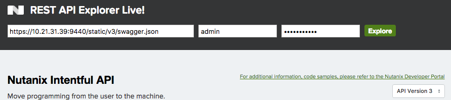
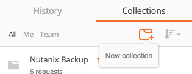
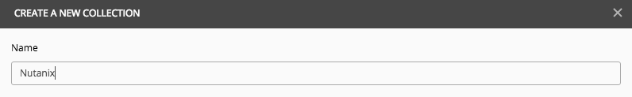
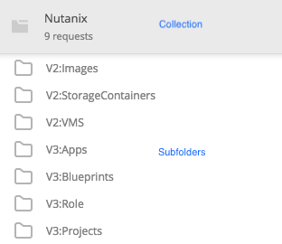
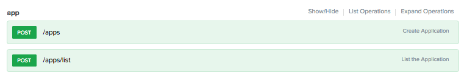
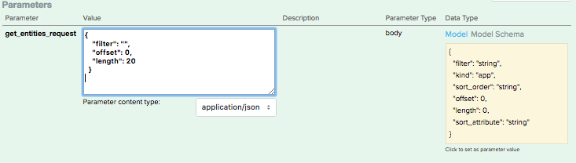
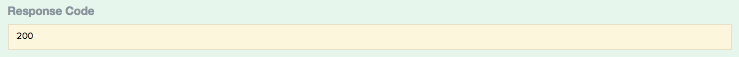

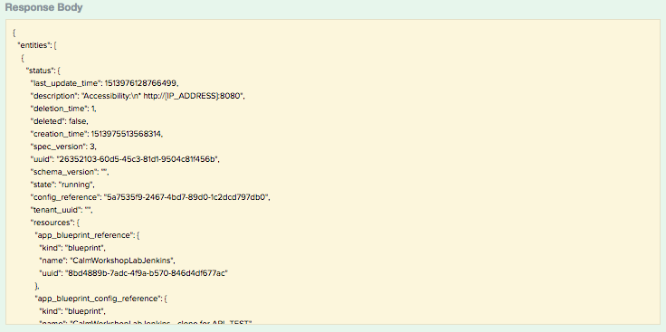
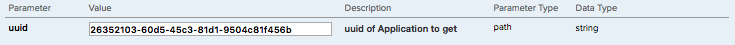

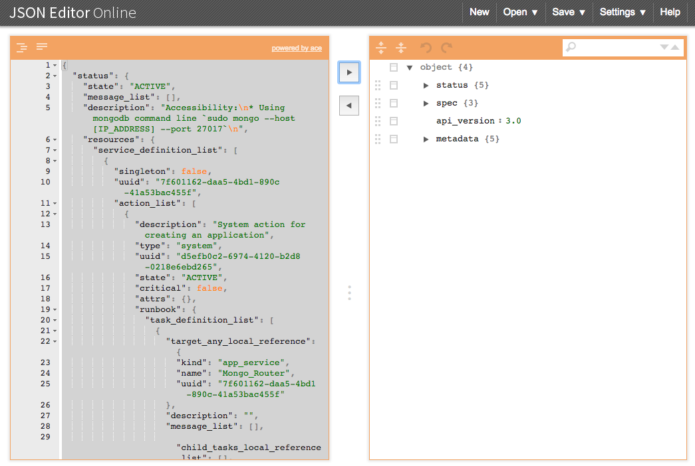
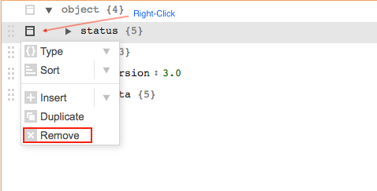
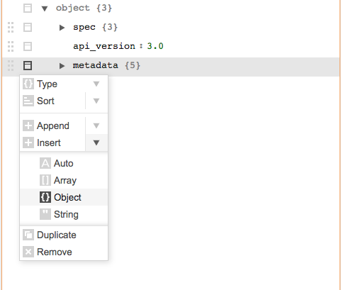
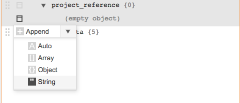
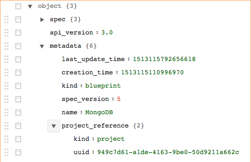
.. |image15| image:: ./media/image25.png
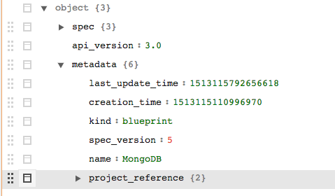
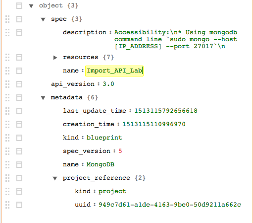

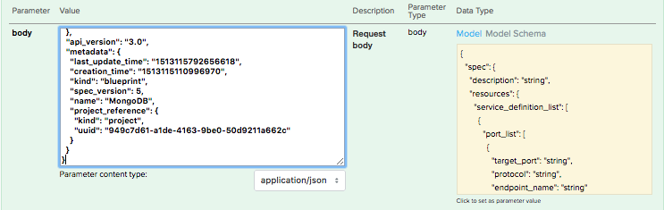
.. |image20| image:: ./media/image30.png
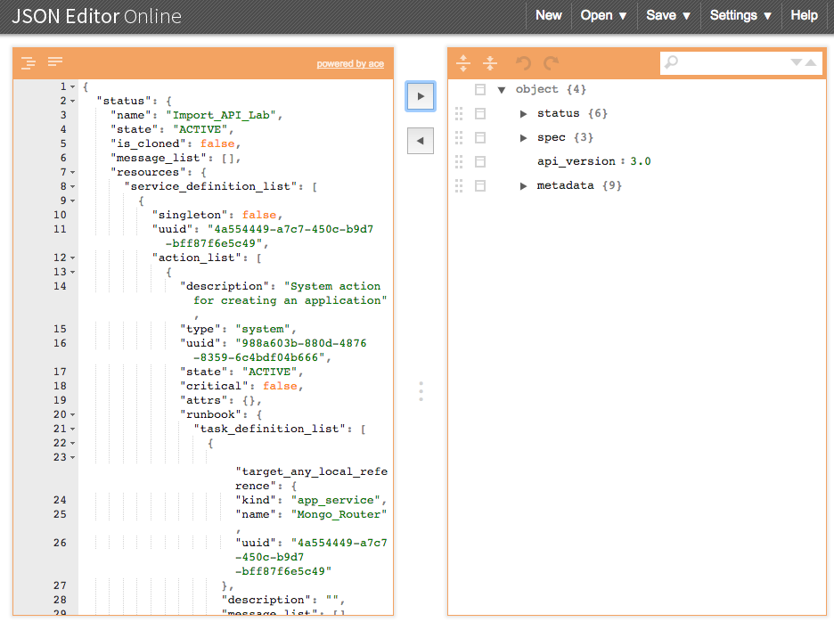
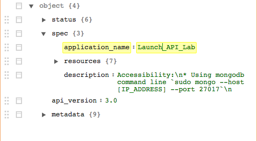
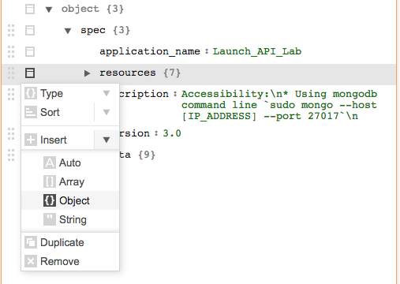
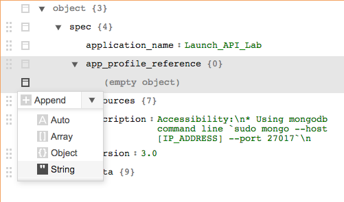
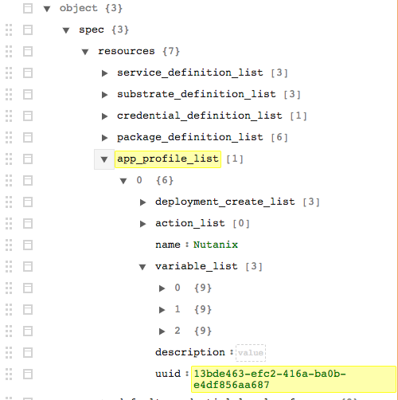
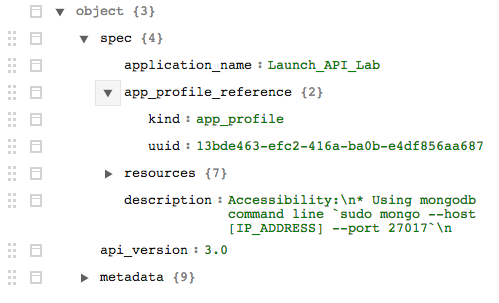
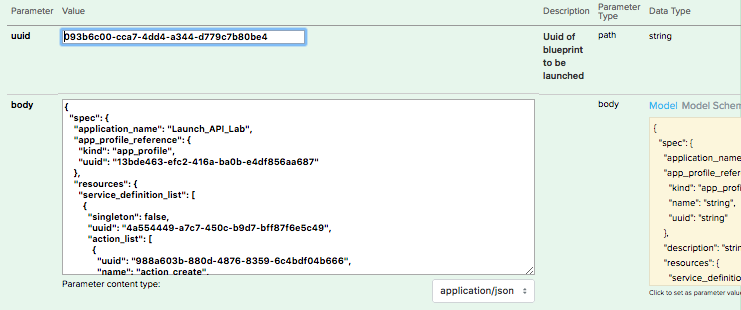
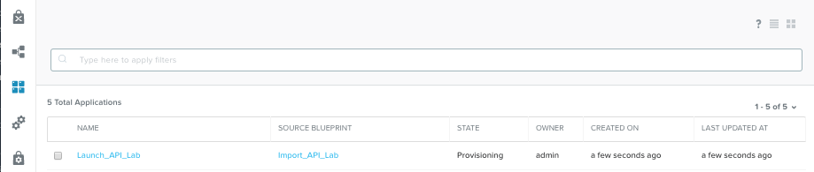

