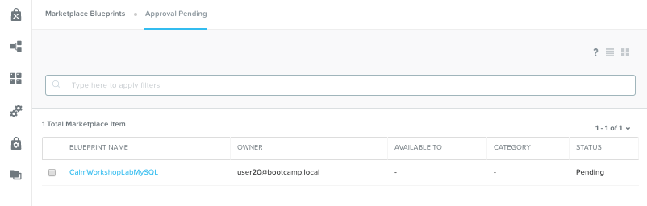
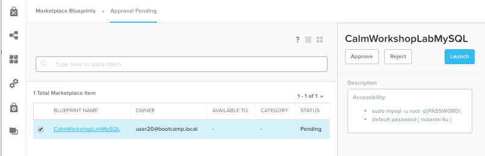
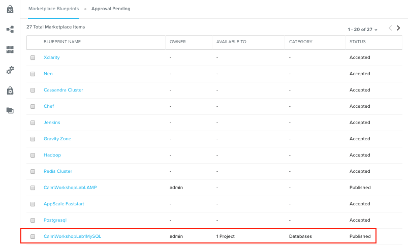
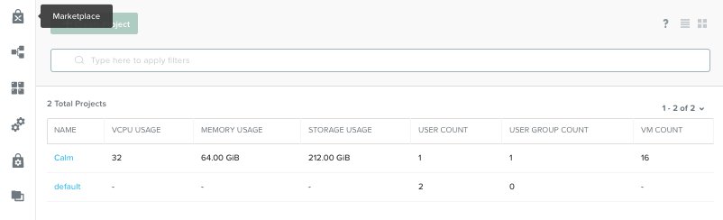

*************************************
**NuCalm Blueprint Marketplace Lab2**
*************************************

.. contents::

Connectivity Instructions:
**************************

+------------+--------------------------------------------------------+
| IP         |                                           Cluster IP   |
+------------+--------------------------------------------------------+
| Username   |                                           Cluster User |
+------------+--------------------------------------------------------+
| Password   |                                           Cluster Pass | 
+------------+--------------------------------------------------------+

Calm Glossary
*************

**Service:** One tier of a multiple tier application. This can be made up of 1 more VMs (or existing machines) that all have the same config and do the same thing **Application (App):** A whole application with multiple parts that are all working towards the same thing (for example, a Web Application might be made up of an Apache Server, a MySQL database and a HAProxy Load balancer. Alone each service doesn’t do much, but as a whole they do what they’re supposed to) **Macro:** A Calm construct that is evaluated before being ran on the target machine. Macros and Variables are denoted in the *@@{[name]}@@* format in the scripts.

Lab Overview
************

In this lab participants will learn how to manage Blueprints within the NuCalm Marketplace.  After this lab
participants should know how to navigate Marketplace Management and configure the Project Environment to deploy Blueprints
from the Marketplace.

In this exercise we'll walk through the steps to:

1. Publish a Blueprint from the Blueprint Workspace to the local Marketplace.
2. Use the Marketplace Manager to approve, assign roles and projects, and publish to the Marketplace.
3. Edit the Project Environment so the blueprint can be launched from the Marketplace as an application.

**Note:** This lab assumes pariticipants have Blueprints built and staged from previous exercises. 

Part 1: Accessing and Navigating Calm
*************************************

Getting Familiar with the Tools

1. Connect to https://[HPOC-IP-ADDRESS]:9440
2. Login to Prism using the credentials specified above (use these credentials unless specified otherwise throughout this lab
3. Click on the Apps tab across the top of Prism

Welcome to Calm! Upon accessing this page you will notice a new ribbon along the left used to navigate through Calm constructs.

Users are dropped into the Applications tab by default, and can see all the application instances that have been launched from a blueprint.

**Tab review:**

|image0|

Part 2: Blueprint Workspace - Publish Blueprints
************************************************

Navigate to the *Blueprint Workspace* by clicking (|image1|) icon located on the left tool ribbon.  This will open the Blueprint Workspace where self-authored blueprints are staged for editing, publishing, or launching as an application.

|image2|

Select an *Active* working Blueprint by clicking on the *Name* and opening the workspace.  With the workspace open, Click the |image3| action located at the top of the Blueprint workspace tool bar. 

|image4|

A modal dialog will appear.  Verify the *Name* and *Description*, and click the Publish button. 

|image5|

Part 3: Marketplace Manager - Approve Blueprint
***********************************************

**Note:** You must be logged in as Admin or have an Admin role to access the *Marketplace Manager*

Navigate to the Marketplace Manager by clicking (|image6|) icon located on the left tool ribbon.  This will open the Marketplace Manager where Blueprints are staged for Marketplace publication.  Scrolling through the Blueprints, you will not sfind the Blueprint published from the *Blueprint Workspace*.  This is becuase the Blueprnt requires approval.

To approve the Blueprint, click the *Approval Pending* action located along the top tool-bar of the *Marketplace Manager*.

|image7|

Click the checkbox to the left of the *Blueprint Name*. 

|image8|

You can choose to reject, approve, or launch the blueprint.

- Reject: Changes the state fo the blueprint publication and stages it in *Approval Pending*
- Approve: Approves the blueprint for publication.
- Launch: Launches the Blueprint as an application - the same as *Blueprint Workspace*

Click *Approve* to approve the Bluerpint for publication.  Once the application has been successfully approved, assign the **Category** and **Project Shared With** as shown below and click **Apply**.

|image9|

Click **Publish** to publish the Blueprint to the Marketplace. Once the Blueprint has been successfully published, the dialog should appear as follows:

|image10|

Verify the Blueprint's publication status by clicking on the **Marketplace Blueprints** action located in the tool-bar along the top of the **Marketplace Manager**.  Scroll through the Blueprints to find your Blueprint

|image11|

Navigate to the Marketplace by clicking (|image6|) icon located on the left tool ribbon.  This will open the Marketplace where Blueprints are staged for collaboration and launching as an application.

|image12|

Part 4: Edit Project Workspace
**********************************************

Before a Bluerpint can be launched from the Marketplace the Project's Environment needs to be configured with:

- **USER:** .  Uerid and password for logging into the VM
- **Network:** A Network for the Blueprint to launch from.

This can be done in the Projects Manager. Navigate to the the Projects Manager by clicking the(|image13|)icon located on the left tool ribbon.  This will open the Projects Manager where projects are persisted.

|image14|

Click the Project name associated with or assigned to with Blueprint during publication.  For this exercise the project is **Calm**.

To assign a user and a network to the Project, click the **Environment** action located along the top tool-bar of the **Project Manager**.  Scroll through the environment settings and find **Network** and **Credentials** and configure them as you did with the blueprint.

- **Network:**  *bootcamp*
- **Credentials**: *user: root*, *password: nutanix/4u*

|image15|

Once configured, click save.

.. |image0| image:: ./media/image2.png

.. |image1| image:: ./media/image14.png
   
.. |image2| image:: ./media/image17.png

.. |image3| image:: ./media/image16.png

.. |image4| image:: ./media/image15.png

.. |image5| image:: ./media/image18.png

.. |image6| image:: ./media/image10.png

.. |image20| image:: ./media/image11.png

.. |image9| image:: ./media/image21.png

.. |image10| image:: ./media/image22.png

.. |image12| image:: ./media/image24.png

.. |image13| image:: ./media/image25.png

.. |image15| image:: ./media/image27.png

 
