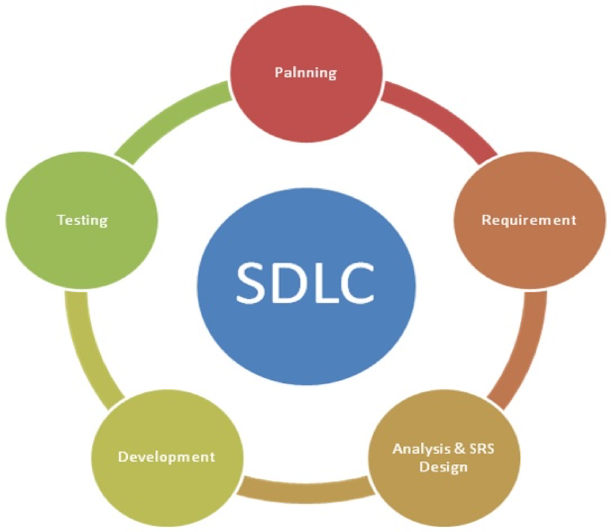
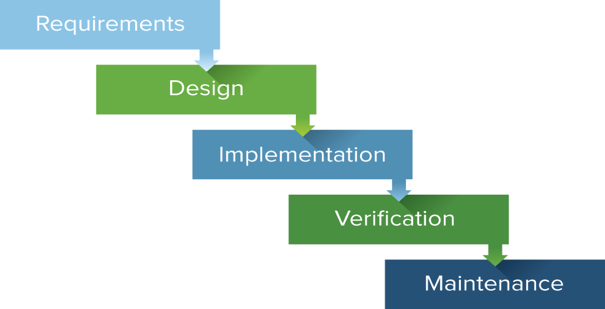

*********************************************************
**Calm Workshop – Software Development Lifecycle (SDLC)**
*********************************************************

**SDLC Objectives**
*******************

I've been doing some research to understand why different methodologies exist, and which ones are the most commonly used software development methodologies.

**SDLC Introduction**

Understanding the fundamentals of SDLC.  A **software development life cycle** is composed of a number of clearly defined and distinct work phases which are used by systems engineers and systems developers to plan for, design, build, test, and deliver information systems.

|image0|

Successful projects are managed well. In order to manage a project efficiently, the manager or dev team must choose which software development method works best for the project at hand.  All of the numerous software development methodologies that exist are used for different reasons. I've been doing some research to understand why different methodologies exist, and which ones are the most commonly used software development methodologies.

SDLC works by lowering the cost of software development while simultaneously improving quality and shortening production time. SDLC achieves these apparently divergent goals by following a plan that removes the typical pitfalls to software development projects. 

That plan starts by evaluating existing systems for deficiencies. 

- Next, it defines the requirements of the new system. 
- It then creates the software through the stages of design, development, testing, and deployment. 
- By anticipating costly mistakes like failing to ask the end user for suggestions, SLDC can eliminate redundant rework and after-the-fact fixes.

**Waterfall Development Model**

Considered the traditional software development method, the waterfall method is a rigid linear model that consists of sequential phases (Requirements, Design, Implementation, Verification, Maintenance) in which distinct goals are accomplished. Each phase must be 100% complete before moving onto the next phase, and traditionally there is no process for going back to modify the project or direction.

|image1|

The linear nature of this method makes it easy to understand and manage. Projects with clear objectives and stable requirements can best use the waterfall method. Less experienced project managers, project teams, and teams whose composition changes frequently may benefit the most from using the waterfall development methodology. However, it is often slow and costly due to the rigid structure and tight controls. These drawbacks led waterfall method users to the explore other development methodologies.

Strengths:

- Easy to understand and use.
- Provides structure to inexperienced staff.
- Milestones are well understood.
- Sets requirements stability.
- Good for manageemnt control (plan, staff, track).
- Worsk well when quality is more important than cost or schedule.

Weaknesses:

- Idealized, doesn't match reality.
- Doesn't reflect itertative nature of exploratory development.
- Unrealistic to expect accurate requirements so early in a project.
- Software is delivered late in project.  Delays bug discovery.
- Difficult to integrate Risk Management.
- Difficult and expensive to make changes to documents - upstream.
- Significant administrative overhead,costly for small teams and projects.

When used:

- Requirements are well understood.
- Product definition is stable.
- Technology is understood.
- New version of an existing product.
- Porting an existing product to a new platform.
- Large projects.

**Spiral Development Model**

- Repetition model with incremental improvements.

Iterative Development Model

- Model that emphasizes repetition.

Agile Development Model

- Model based on division of work.

Test Driven Development Model

- Model based on development around test acceptance.

   

