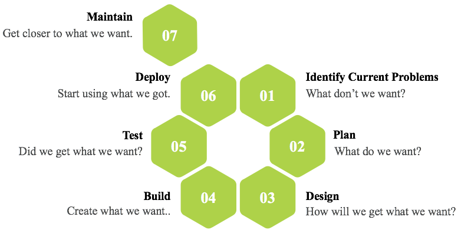
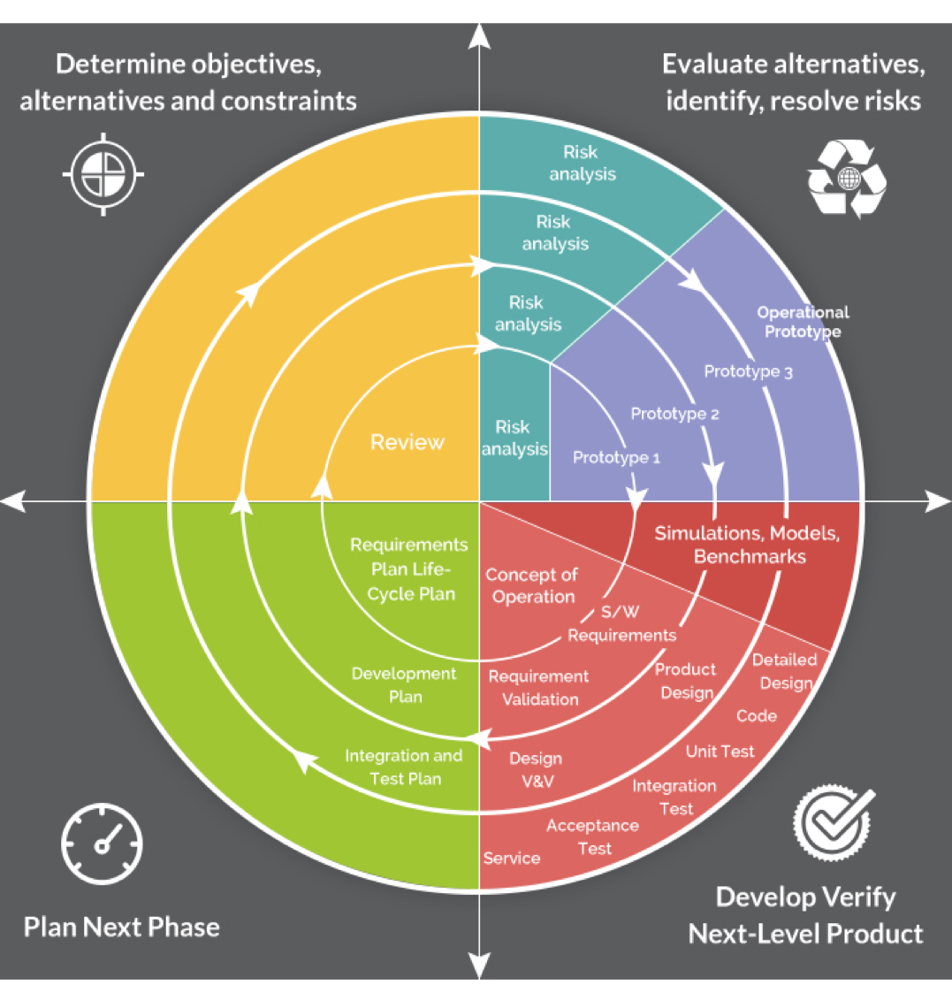
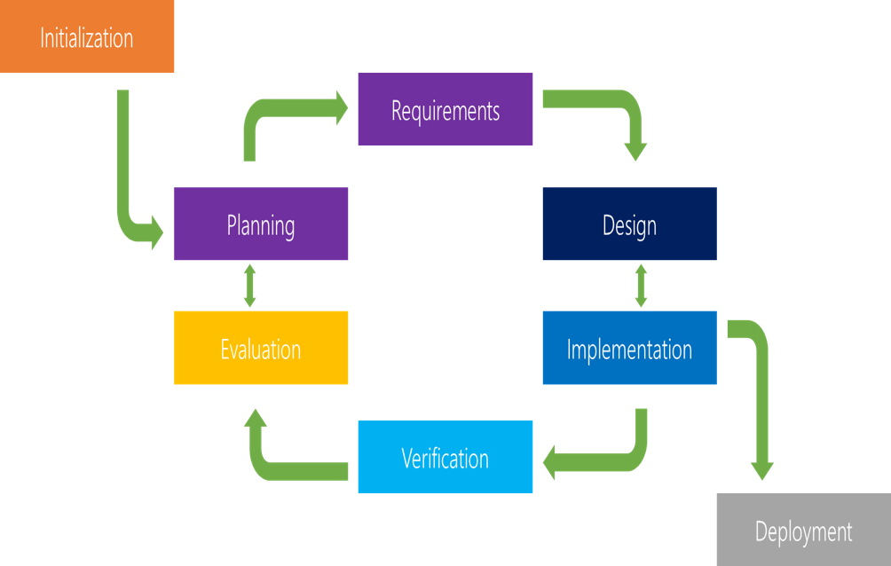
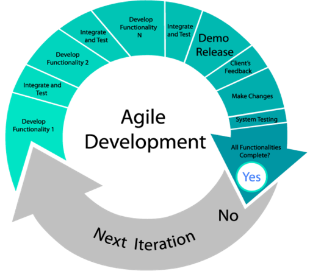
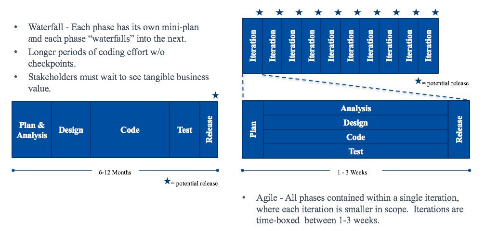
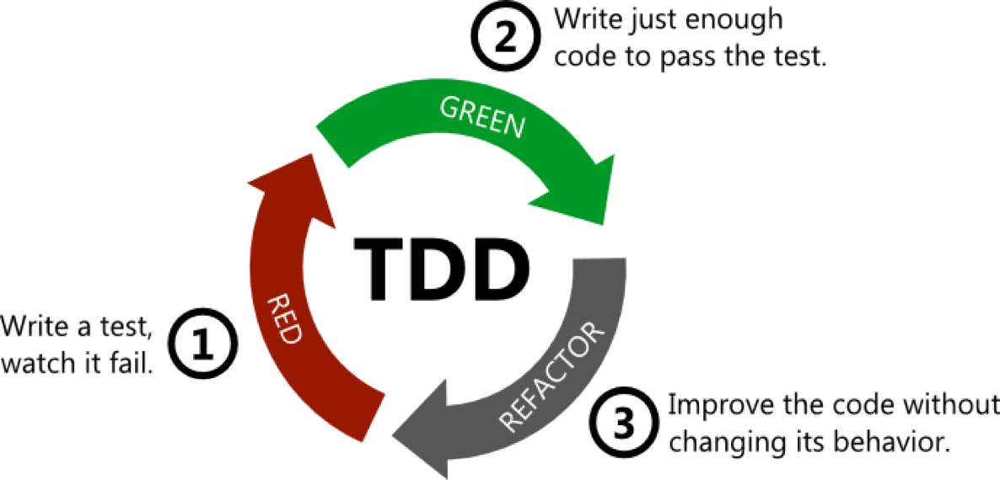

*********************************************************
**Calm Workshop – Software Development Lifecycle (SDLC)**
*********************************************************

.. contents::

   
**SDLC Introduction**
*********************

Understanding the fundamentals of SDLC.  A **software development life cycle** is composed of a number of clearly defined and distinct work phases which are used by systems engineers and systems developers to plan for, design, build, test, and deliver information systems.

|image0|

Successful projects are managed well. In order to manage a project efficiently, the manager or dev team must choose which software development method works best for the project at hand. All of the numerous software development methodologies that exist are used for different reasons. I've been doing some research to understand why different methodologies exist, and which ones are the most commonly used software development methodologies.

SDLC works by lowering the cost of software development while simultaneously improving quality and shortening production time. SDLC achieves these apparently divergent goals by following a plan that removes the typical pitfalls to software development projects. 

That plan starts by evaluating existing systems for deficiencies. 

- Next, it defines the requirements of the new system. 
- It then creates the software through the stages of design, development, testing, and deployment. 
- By anticipating costly mistakes like failing to ask the end user for suggestions, SLDC can eliminate redundant rework and after-the-fact fixes.

**Stages and Best Practices of SDLC**
*************************************

By Following the best practices and/or stages of SDLC ensures the process works in a smooth, efficient, and productive way.

|image1|

**Identify the current problems. “What don’t we want?”:**

This stage of SDLC means getting input from all stakeholders, including customers, salespeople, industry experts, and programmers. Learn the strengths and weaknesses of the current system with improvement as the goal.

**Plan. “What do we want?”:**

In this stage of SDLC, the team defines the requirements of the new software and determines the cost and resources required. It also details the risks involved and provides sub-plans for softening those risks. In this stage, a Software Requirement Specification document is created.

**Design. “How will we get what we want?”:**

It is the most creative and challenging phase of SDLC.

Occurs in two phases: 

- Logical Design - Specifies user needs. 
- Physical Design - Tells the programmer what the candidate system must do. 

This phase of SDLC starts by turning the software specifications into a design plan called the Design Specification. All stakeholders then review this plan and offer feedback and suggestions. It’s crucial to have a plan for collecting and incorporating stakeholder input into this document. Failure at this stage will almost certainly result in cost overruns at best and total collapse of the project at worst. 

**Build. “Let’s create what we want.”:**

This SDLC stage develops the software by generating all the actual code. If the previous steps have been followed with attention to detail, this is actually the least complicated step.

Less creative then designing phase. 

It is of 3 types: 

- Implementation of a computer system to replace a manual system. 
- Implementation of a new computer system to replace an existing one. 
- Implementation of a modified application to replace existing one on same computer. 

Parallel Runs: In this new system runs with old system which provides assurance, and even helps user staff gain experience. 

**Test. “Did we get what we want?”:**

In this stage, we test for defects and deficiencies. We fix those issues until the product meets the original specifications.

The objective is to determine if the system does what it is designed to do 
Does it support the user as required in an effective and efficient manner 
The review should assess how successful the system is in terms of functionality, performance, and cost versus benefits. 

**Deploy. “Let’s start using what we got.”:**

Often, this part of the SDLC process happens in a limited way at first. Depending on feedback from end users, more adjustments can be made.

**Maintain. “Let’s get this closer to what we want.”:**

The plan almost never turns out perfect when it meets reality. Further, as conditions in the real world change, we need to update and advance the software to match.  The emphasis during this phase is to ensure that needs continue to be met and that the system continues to perform according to specification

Routine hardware and software maintenance and upgrades are performed to ensure effective system operations. 
User training continues during this phase, as needed, to acquaint new users to the system or to introduce new features to current users 

**Note:** The DevOps movement has changed the SDLC in some ways. Developers are now responsible for more and more steps of the entire development process. We also see the value of shifting left. When development and Ops teams use the same toolset to track performance and pin down defects from inception to the retirement of an application, this provides a common language and faster handoffs between teams. APM tools can be used in development, QA, and production. This keeps everyone using the same toolset across the entire development lifecycle.

**Waterfall Development Model**
*******************************

Considered the traditional software development method, the waterfall method is a rigid linear model that consists of sequential phases (Requirements, Design, Implementation, Verification, Maintenance) in which distinct goals are accomplished. Each phase must be 100% complete before moving onto the next phase, and traditionally there is no process for going back to modify the project or direction.

|image2|

The linear nature of this method makes it easy to understand and manage. Projects with clear objectives and stable requirements can best use the waterfall method. Less experienced project managers, project teams, and teams whose composition changes frequently may benefit the most from using the waterfall development methodology. However, it is often slow and costly due to the rigid structure and tight controls. These drawbacks led waterfall method users to the explore other development methodologies.

Strengths:

- Easy to understand and use.
- Provides structure to inexperienced staff.
- Milestones are well understood.
- Sets requirements stability.
- Good for management control (plan, staff, track).
- Worsk well when quality is more important than cost or schedule.

Weaknesses:

- Idealized, doesn't match reality.
- Doesn't reflect itertative nature of exploratory development.
- Unrealistic to expect accurate requirements so early in a project.
- Software is delivered late in project.  Delays bug discovery.
- Difficult to integrate Risk Management.
- Difficult and expensive to make changes to documents - upstream.
- Significant administrative overhead,costly for small teams and projects.

Application:

- Requirements are well understood.
- Product definition is stable.
- Technology is understood.
- New version of an existing product.
- Porting an existing product to a new platform.
- Large projects.

**Spiral Development Model**
****************************

The spiral model combines the idea of iterative development with the systematic, controlled aspects of the waterfall model. This Spiral model is a combination of iterative development process model and sequential linear development model i.e. the waterfall model with a very high emphasis on risk analysis. It allows incremental releases of the product or incremental refinement through each iteration around the spiral.

|image3|

The spiral model has four phases. A software project repeatedly passes through these phases in iterations called Spirals.

**Identification:**

This phase starts with gathering the business requirements in the baseline spiral. In the subsequent spirals as the product matures, identification of system requirements, subsystem requirements and unit requirements are all done in this phase.

This phase also includes understanding the system requirements by continuous communication between the customer and the system analyst. At the end of the spiral, the product is deployed in the identified market.

**Design:**

The Design phase starts with the conceptual design in the baseline spiral and involves architectural design, logical design of modules, physical product design and the final design in the subsequent spirals.

**Contruct/Build:**

The Construct phase refers to production of the actual software product at every spiral. In the baseline spiral, when the product is just thought of and the design is being developed a POC (Proof of Concept) is developed in this phase to get customer feedback.

Then in the subsequent spirals with higher clarity on requirements and design details a working model of the software called build is produced with a version number. These builds are sent to the customer for feedback.

**Evaluation and risk Analysis:**

Risk Analysis includes identifying, estimating and monitoring the technical feasibility and management risks, such as schedule slippage and cost overrun. After testing the build, at the end of first iteration, the customer evaluates the software and provides feedback.

The following illustration is a representation of the Spiral Model, listing the activities in each phase.

Based on the customer evaluation, the software development process enters the next iteration and subsequently follows the linear approach to implement the feedback suggested by the customer. The process of iterations along the spiral continues throughout the life of the software.

Strengths:

- Provide early indication of risk without much cost.
- Users see the system early because of rapid prototype tools.
- Critical high-risk functions are developed first.
- Design doesn’t have to be perfect.
- Users can be tied to all lifecycle steps.
- Early and frequent feedback from users.
- Cumulative costs assessed frequently.

Weaknesses:

- Time spent evaluating risks too large for small or low-risk projects.
- Time spent planning, resetting objectives, performing risk analysis and prototyping may be excessive.
- Model is complex.
- Spiral may continue indefinitely .
- Risk assessment expertise is required.
- Developers must be reassigned during non-development phase activities.
- Might be difficult to define objective, verifiable milestones indicating readiness to advance to next iteration.

Application:

- When creation of prototype is appropriate.
- When costs and risk evaluation is important.
- For medium to high-risk projects.
- Long-term project commitment unwise because of potential changes to economic priorities.
- Users are unsure of their needs.
- Requirements are complex.
- New product line.
- Significant changes are expected.

**Iterative Development Model**
*******************************

Iterative process starts with a simple implementation of a subset of the software requirements and iteratively enhances the evolving versions until the full system is implemented. At each iteration, design modifications are made and new functional capabilities are added. The basic idea behind this method is to develop a system through repeated cycles (iterative) and in smaller portions at a time (incremental).

The following illustration is a representation of the Iterative and Incremental model

|image4|

Iterative and Incremental development is a combination of both iterative design or iterative method and incremental build model for development. "During software development, more than one iteration of the software development cycle may be in progress at the same time." This process may be described as an "evolutionary acquisition" or "incremental build" approach."

In this incremental model, the whole requirement is divided into various builds. During each iteration, the development module goes through the requirements, design, implementation and testing phases. Each subsequent release of the module adds function to the previous release. The process continues till the complete system is ready as per the requirement.

The key to a successful adoption of an iterative software development lifecycle is rigorous validation of requirements, and verification & testing of each version of the software against those requirements within each cycle of the model. As the software evolves through successive cycles, tests must be repeated and extended to verify each version of the software.

- Starts with a simple implementation of a subset of the software requirements and iteratively enhances the evolving versions until the full system is implemented.
- During each iteration, design modifications are made and new functional capabilities are added.
- Objective is to develop a system through repeated cycles (iterative) and in smaller portions at a time (incremental)

Strengths:

- Some working functionality can be developed quickly early in the lifecycle.
- Parallel development can be planned.
- Results are obtained early and periodically.  Progress can be incrementally measured.
- Less costly when changing scope of requirements.
- Easier to manage risk – High risk items done first.
- Early and frequent feedback from users.
- Issues, challenges and risks identified from each increment can be utilized/applied to the next increment.

Weaknesses:

- May require more resources.
- Management intensive. Management complexity increased.
- End of project may not be known.
- Highly skilled resources are required for risk analysis.
- Risk assessment expertise is required.
- Not suitable for smaller projects.
- Defining increments may require defining complete system.

Application:

Like other SDLC models, Iterative and incremental development has some specific applications in the software industry. This model is most often used in the following scenarios.

- System requirements are clearly defined and understood.
- Some functionality or requested enhancements evolve over time.
- Time to market constraint.
- New technologies being used by the development team.
- Resources with needed skill sets are not available and are planned to be used on contract.
- Some high-risk features and goals may change.

**Agile Development Model**
***************************

The Agile software development life cycle is based upon the iterative and incremental process models, and focuses upon adaptability to changing product requirements and enhancing customer satisfaction through rapid delivery of working product features and client participation. Agile methods primarily focus upon breaking up the entire product into smaller, easily developable, “shippable” product features developed through “incremental” cycles known as “sprints”.

|image5|

Each Agile sprint traditionally lasts from two weeks up to one month. Agile trends now indicate they typically last from seven days up to ten “working” days. Cross-functional teams work simultaneously while developing the product features in daily sprints. The team members are generally experienced and possess varied levels of expertise in activities such as designing, coding, testing, and quality acceptance. At the end of each sprint, a working product feature(s) is developed and presented to the product owner for verification purposes. Once the PO Okays the development, it is presented to the stakeholders, and their opinions are carefully noted to improve upon the current product development cycle. The entire process is repeated through sprints until all the constituent product features are developed.

**Agile software life cycle basics**

An Agile software life cycle is much different as compared to traditional software development frameworks like Waterfall. In Agile, more emphasis is given to sustained and quick development of product features rather than spending more time during the initial project planning, and analysing the actual requirements. The Agile team develops the product through a series of iterative cycles known as sprints. Besides development activity, other aspects pertaining to development such as product analysis, designing the product features, developing the functionality, and “testing” the development for bugs are also carried out during the sprints. The incremental cycles should always produce a “shippable” product release that can be readily deployed.

|image6|

Agile Methods break the product into small incremental builds. These builds are provided in iterations or sprints. Each iteration/sprint typically lasts from about one to three weeks. Every iteration involves cross functional teams working simultaneously in various areas like:

- Planning
- Requirements Analysis
- Design
- Coding
- Unit Testing and
- Acceptance Testing

At the end of the iteration/sprint, a working product is displayed to the customer and important stakeholders.

Agile processes make extensive use of events such as the daily scrum meetings, sprint review meeting, and the sprint retrospective meeting to identify and self-correct the development carried out by the team. Feedback is solicited frequently, as and when needed, to collaborate, and speed up the development process through sharing of ideas and self-management. The feedback system helps to support the self-correction features of Agile frameworks, and is very important.

The roles played in the Agile process constitute of the product owner, scrum master, and the development team. The product owner “owns” the project on behalf of the stakeholders and ensures that the entire project is developed successfully keeping in mind the stakeholders vision of the product as it should “appear” in the market. The scrum master ensures that the Agile process is followed at all times, and does his or her best to resolve any difficulties or technical issues arising during the development process. The team members participate actively in the daily sprints and make sure meaningful and useful development of product features is presented at all times.

**Agile - Extreme Programming (XP) Definition:**

Extreme Programming (XP) is an agile software development framework that aims to produce higher quality software, and higher quality of life for the development team. XP is the most specific of the agile frameworks regarding appropriate engineering practices for software development.

Due to XP’s specificity when it comes to it’s full set of software engineering practices, there are several situations where you may not want to fully practice XP.

While you can’t use the entire XP framework in many situations, that shouldn’t stop you from using as many of the practices as possible given your context.

**Values**

The five values of XP are communication, simplicity, feedback, courage, and respect and are described in more detail below.

Communication

Software development is inherently a team sport that relies on communication to transfer knowledge from one team member to everyone else on the team. XP stresses the importance of the appropriate kind of communication - face to face discussion with the aid of a white board or other drawing mechanism.

Simplicity

Simplicity means “what is the simplest thing that will work?” The purpose of this is to avoid waste and do only absolutely necessary things such as keep the design of the system as simple as possible so that it is easier to maintain, support, and revise. Simplicity also means address only the requirements that you know about; don’t try to predict the future.

Feedback

Through constant feedback about their previous efforts, teams can identify areas for improvement and revise their practices. Feedback also supports simple design. Your team builds something, gathers feedback on your design and implementation, and then adjust your product going forward.

Courage

Kent Beck defined courage as “effective action in the face of fear”. This definition shows a preference for action based on other principles so that the results aren’t harmful to the team. You need courage to raise organizational issues that reduce your team’s effectiveness. You need courage to stop doing something that doesn’t work and try something else. You need courage to accept and act on feedback, even when it’s difficult to accept.

Respect

The members of your team need to respect each other in order to communicate with each other, provide and accept feedback that honors your relationship, and to work together to identify simple designs and solutions.

Practices

The core of Extreme Programming (XP) is the interconnected set of software development practices listed below. While it is possible to do these practices in isolation, many teams have found some practices reinforce the others and should be done in conjunction to fully eliminate the risks you often face in software development.

The Extreme Programming (XP) Practices have changed a bit since they were initially introduced.The original twelve practices are listed below. If you would like more information about how these practices were originally described, you can 

- The Planning Game
- Small Releases
- Metaphor
- Simple Design
- Testing
- Refactoring
- Pair Programming
- Collective Ownership
- Continuous Integration
- 40-hour week
- On-site Customer
- Coding Standard

Below are the descriptions of the practices as described in the second edition of Extreme Programming Explained Embrace Change. These descriptions include refinements based on experiences of many who practice extreme programming and reflect a more practical set of practices.

Sit Together

Since communication is one of the five values of XP, and most people agree that face to face conversation is the best form of communication, have your team sit together in the same space without barriers to communication, such as cubicle walls.

Whole Team

A cross functional group of people with the necessary roles for a product form a single team. This means people with a need as well as all the people who play some part in satisfying that need all work together on a daily basis to accomplish a specific outcome.

Informative Workspace

Set up your team space to facilitate face to face communication, allow people to have some privacy when they need it, and make the work of the team transparent to each other and to interested parties outside the team. Utilize Information Radiators to actively communicate up-to-date information.

Energized Work

You are most effective at software development and all knowledge work when you are focused and free from distractions.
Energized work means taking steps to make sure you are able physically and mentally to get into a focused state. This means do not overwork yourself (or let others overwork you). It also means stay healthy, and show respect to your teammates to keep them healthy.

Pair Programming

Pair Programming means all production software is developed by two people sitting at the same machine. The idea behind this practice is that two brains and four eyes are better than one brain and two eyes. You effectively get a continuous code review and quicker response to nagging problems that may stop one person dead in their tracks.
Teams that have used pair programming have found that it improves quality and does not actually take twice as long because they are able to work through problems quicker and they stay more focused on the task at hand, thereby creating less code to accomplish the same thing.
Stories

Describe what the product should do in terms meaningful to customers and users. These stories are intended to be short descriptions of things users want to be able to do with the product that can be used for planning and serve as reminders for more detailed conversations when the team gets around to realizing that particular story.

Weekly Cycle

The Weekly Cycle is synonymous to an iteration. In the case of XP, the team meets on the first day of the week to reflect on progress to date, the customer picks the stories they would like delivered in that week, and the team determines how they will approach those stories. The goal by the end of the week is to have running tested features that realize the selected stories.
The intent behind the time boxed delivery period is to produce something to show to the customer for feedback.

Quarterly Cycle

The Quarterly Cycle is synonymous to a release. The purpose is to keep the detailed work of each weekly cycle in context of the overall project. The customer lays out the overall plan for the team in terms of features desired within a particular quarter, which provides the team with a view of the forest while they are in the trees, and it also helps the customer to work with other stakeholders who may need some idea of when features will be available.
Remember when planning a quarterly cycle the information about any particular story is at a relatively high level, the order of story delivery within a Quarterly Cycle can change and the stories included in the Quarterly Cycle may change. If you are able to revisit the plan on a weekly basis following each weekly cycle, you can keep everyone informed as soon as those changes become apparent to keep surprises to a minimum.

Slack

The idea behind slack in XP terms is to add some low priority tasks or stories in your weekly and quarterly cycles that can be dropped if the team gets behind on more important tasks or stories. Put another way, account for the inherent variability in estimates to make sure you leave yourself a good chance of meeting your forecasts.

Ten-Minute Build
The goal with the Ten-Minute Build is to automatically build the whole system and run all of the tests in ten minutes. The founders of XP suggested a 10 minute time frame because if a team has a build that takes longer than that, it is less likely to be run on a frequent basis, thus introducing longer time between errors.
This practice encourages your team to automate your build process so that you are more likely to do it on a regular basis and to use that automated build process to run all of your tests.
This practice supports the practice of Continuous Integration and is supported by the practice of Test First Development.

Continuous Integration

Continuous Integration is a practice where code changes are immediately tested when they are added to a larger code base. The benefit of this practice is you can catch and fix integration issues sooner. Most teams dread the code integration step because of the inherent discovery of conflicts and issues that result. Most teams take the approach “If it hurts, avoid it as long as possible”. Practitioners of XP suggest “if it hurts, do it more often”. The reasoning behind that approach is that if you experience problems every time you integrate code, and it takes a while to find where the problems are, perhaps you should integrate more often so that if there are problems, they are much easier to find because there are fewer changes incorporated into the build.This practice requires some extra discipline and is highly dependent on Ten Minute Build and Test First Development.

Test-First Programming instead of following the normal path of:

- develop code -> write tests -> run tests 

The practice of Test-First Programming follows the path of:

- Write failing automated test -> Run failing test -> develop code to make test pass -> run test -> repeat
As with Continuous Integration, Test-First Programming reduces the feedback cycle for developers to identify and resolve issues, thereby decreasing the number of bugs that get introduced into production.

Incremental Design

The practice of Incremental Design suggests that you do a little bit of work up front to understand the proper breadth-wise perspective of the system design, and then dive into the details of a particular aspect of that design when you deliver specific features. This approach reduces the cost of changes and allows you to make design decisions when necessary based on the most current information available.
The practice of Refactoring was originally listed among the 12 core, but was incorporated into the practice of Incremental Design. Refactoring is an excellent practice to use to keep the design simple, and one of the most recommended uses of refactoring is to remove duplication of processes.

Roles

Although Extreme Programming specifies particular practices for your team to follow, it does not really establish specific roles for the people on your team.

Depending on which source you read, there is either no guidance, or there is a description of how roles typically found in more traditional projects behave on Extreme Programming projects. Here are four most common roles associated with Extreme Programming:

The Customer

The Customer role is responsible for making all of the business decisions regarding the project including:
What should the system do (What features are included and what do they accomplish)?
How do we know when the system is done (what are our acceptance criteria)?
How much do we have to spend (what is the available funding, what is the business case)?
What should we do next (in what order do we deliver these features)?
The XP Customer is expected to be actively engaged on the project and ideally becomes part of the team.
The XP Customer is assumed to be a single person, however experience has shown that one person cannot adequately provide all of the business related information about a project. Your team needs to make sure that you get a complete picture of the business perspective, but have some means of dealing with conflicts in that information so that you can get clear direction.

The Developer

Because XP does not have much need for role definition, everyone on the team (with the exception of the customer and a couple of secondary roles listed below) is labeled a developer. Developers are responsible for realizing the stories identified by the Customer. Because different projects require a different mix of skills, and because the XP method relies on a cross functional team providing the appropriate mix of skills, the creators of XP felt no need for further role definition.

The Tracker

Some teams may have a tracker as part of their team. This is often one of the developers who spends part of their time each week filling this extra role. The main purpose of this role is to keep track of relevant metrics that the team feels necessary to track their progress and to identify areas for improvement. Key metrics that your team may track include velocity, reasons for changes to velocity, amount of overtime worked, and passing and failing tests.
This is not a required role for your team, and is generally only established if your team determines a true need for keeping track of several metrics.

The Coach

If your team is just getting started applying XP, you may find it helpful to include a Coach on your team. This is usually an outside consultant or someone from elsewhere in your organization who has used XP before and is included in your team to help mentor the other team members on the XP Practices and to help your team maintain your self discipline.
The main value of the coach is that they have gone through it before and can help your team avoid mistakes that most new teams make.

Lifecycle

To describe XP in terms of a lifecycle it is probably most appropriate to revisit the concept of the Weekly Cycle and Quarterly Cycle.  First, start off by describing the desired results of the project by having customers define a set of stories. As these stories are being created, the team estimates the size of each story. This size estimate, along with relative benefit as estimated by the customer can provide an indication of relative value which the customer can use to determine priority of the stories.

If the team identifies some stories that they are unable to estimate because they don’t understand all of the technical considerations involved, they can introduce a spike to do some focused research on that particular story or a common aspect of multiple stories. Spikes are short, time-boxed time frames set aside for the purposes of doing research on a particular aspect of the project. Spikes can occur before regular iterations start or alongside ongoing iterations.Next, the entire team gets together to create a release plan that everyone feels is reasonable. This release plan is a first pass at what stories will be delivered in a particular quarter, or release. The stories delivered should be based on what value they provide and considerations about how various stories support each other.Then the team launches into a series of weekly cycles. At the beginning of each weekly cycle, the team (including the customer) gets together to decide which stories will be realized during that week. The team then breaks those stories into tasks to be completed within that week.At the end of the week, the team and customer review progress to date and the customer can decide whether the project should continue, or if sufficient value has been delivered.

Origins

XP was first used on the Chrysler Comprehensive Compensation (C3) program which was initiated in the mid 90’s and switched to an XP project when Kent Beck was brought on to the project to improve the performance of the system. He wound up adding a couple of other folks, including Ron Jeffries to the team and changing the way the team approached development. This project helped to bring the XP methodology into focus and the several books written by people who were on the project helped spread knowledge about and adaptation of this approach.

Primary Contributions

XP’s primary contribution to the software development world is an interdependent collection of engineering practices that teams can use to be more effective and produce higher quality code. Many teams adopting agile start by using a different framework and when they identify the need for more disciplined engineering practices they adopt several if not all of the engineering practices espoused by XP.

An additional, and equally important, contribution of XP is the focus on practice excellence. The method prescribes a small number of absolutely essential practices and encourages teams to perform those practices as good as they possibly can, almost to the extreme. This is where the name comes from. Not because the practices themselves are necessarily radical (although some consider some of them pretty far out) rather that teams continuously focus so intently on continuously improving their ability to perform those few practices.

Strengths:

- Is a very realistic approach to software development.
- Promotes teamwork and cross training.
- Functionality can be developed rapidly and demonstrated.
- Resource requirements are minimum.
- Suitable for fixed or changing requirements
- Delivers early partial working solutions.
- Good model for environments that change steadily.
- Minimal rules, documentation easily employed.
- Enables concurrent development and delivery within an overall planned context.
- Little or no planning required.
- Easy to manage.
- Gives flexibility to developers.

Weaknesses:

- Not suitable for handling complex dependencies.
- More risk of sustainability, maintainability and extensibility.
- An overall plan, an agile leader and agile PM practice is a must without which it will not work.
- Strict delivery management dictates the scope, functionality to be delivered, and adjustments to meet the deadlines.
- Depends heavily on customer interaction, so if customer is not clear, team can be driven in the wrong direction.
- There is a very high individual dependency, since there is minimum documentation generated.
- Transfer of technology to new team members may be quite challenging due to lack of documentation.

Application:

- Time to market constraints.
- New technologies being used by the development team.
- Organizations that employ disciplined methods

**Test Driven Development Model**
*********************************

Test-driven development (TDD) is a software development process that relies on the repetition of a very short development cycle: first the developer writes an (initially failing) automated test case that defines a desired improvement or new function, then produces the minimum amount of code to pass that test, and finally refactors the new code to acceptable standards.

The following sequence of steps is generally followed:

- Add a test
- Run all tests and see if the new one fails
- Write some code
- Run tests
- Refactor code
- Repeat

|image7|

The first step is to quickly add a test, basically just enough code to fail.  Next you run your tests, often the complete test suite although for sake of speed you may decide to run only a subset, to ensure that the new test does in fact fail. You then update your functional code to make it pass the new tests. The fourth step is to run your tests again. If they fail you need to update your functional code and retest. Once the tests pass the next step is to start over (you may first need to refactor any duplication out of your design as needed, turning TFD into TDD).

TDD completely turns traditional development around. When you first go to implement a new feature, the first question that you ask is whether the existing design is the best design possible that enables you to implement that functionality. If so, you proceed via a TFD approach.  If not, you refactor it locally to change the portion of the design affected by the new feature, enabling you to add that feature as easy as possible. As a result you will always be improving the quality of your design, thereby making it easier to work with in the future.

Instead of writing functional code first and then your testing code as an afterthought, if you write it at all, you instead write your test code before your functional code.  Furthermore, you do so in very small steps – one test and a small bit of corresponding functional code at a time.  A programmer taking a TDD approach refuses to write a new function until there is first a test that fails because that function isn’t present. In fact, they refuse to add even a single line of code until a test exists for it.  Once the test is in place they then do the work required to ensure that the test suite now passes (your new code may break several existing tests as well as the new one).  This sounds simple in principle, but when you are first learning to take a TDD approach it proves require great discipline because it is easy to “slip” and write functional code without first writing a new test.  One of the advantages of pair programming is that your pair helps you to stay on track.

**There are two levels of TDD:**

- Acceptance TDD (ATDD).  With ATDD you write a single acceptance test, or behavioral specification depending on your preferred terminology, and then just enough production functionality/code to fulfill that test. The goal of ATDD is to specify detailed, executable requirements for your solution on a just in time (JIT) basis. ATDD is also called Behavior Driven Development (BDD).

- Developer TDD. With developer TDD you write a single developer test, sometimes inaccurately referred to as a unit test, and then just enough production code to fulfill that test. The goal of developer TDD is to specify a detailed, executable design for your solution on a JIT basis. Developer TDD is often simply called TDD.

Test-driven development (TDD) is a development technique where you must first write a test that fails before you write new functional code.  TDD is being quickly adopted by agile software developers for development of application source code and is even being adopted by Agile DBAs for database development.  TDD should be seen as complementary to Agile Model Driven Development (AMDD)approaches and the two can and should be used together. TDD does not replace traditional testing, instead it defines a proven way to ensure effective unit testing. A side effect of TDD is that the resulting tests are working examples for invoking the code, thereby providing a working specification for the code. My experience is that TDD works incredibly well in practice and it is something that all software developers should consider adopting.
 

.. |image0| image:: ./media/image1.png
   :width: 3in
   :height: 2in
   

.. |image2| image:: ./media/image2.png
   :width: 4.73125in
   :height: 3.03056in
   

   

   

   

   

